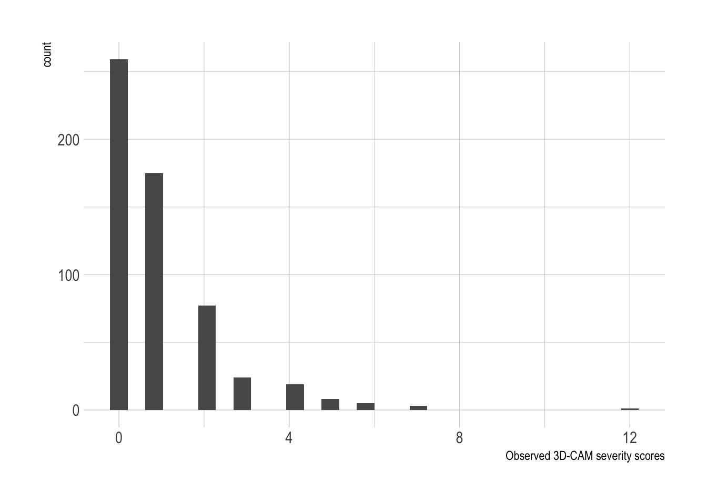

::: {.cell}

:::

::: {.cell}

:::


# Data

The data for this harmonization analysis come from the Intuit and SAGES studies.

The SAGES study didn't have the proper 3D-CAM.  The CAM-S items in SAGES were transformed to approximate the 3D-CAM items.

::: {.cell}

:::

## Item summaries

@tbl-desc-items shows the percent each of the 20 items was endorsed by study.

::: {#tbl-desc-items .cell tbl-cap='Item summaries by study'}
::: {.cell-output-display}

```{=html}
<div id="aklawaikmf" style="padding-left:0px;padding-right:0px;padding-top:10px;padding-bottom:10px;overflow-x:auto;overflow-y:auto;width:auto;height:auto;">
<style>#aklawaikmf table {
  font-family: system-ui, 'Segoe UI', Roboto, Helvetica, Arial, sans-serif, 'Apple Color Emoji', 'Segoe UI Emoji', 'Segoe UI Symbol', 'Noto Color Emoji';
  -webkit-font-smoothing: antialiased;
  -moz-osx-font-smoothing: grayscale;
}

#aklawaikmf thead, #aklawaikmf tbody, #aklawaikmf tfoot, #aklawaikmf tr, #aklawaikmf td, #aklawaikmf th {
  border-style: none;
}

#aklawaikmf p {
  margin: 0;
  padding: 0;
}

#aklawaikmf .gt_table {
  display: table;
  border-collapse: collapse;
  line-height: normal;
  margin-left: auto;
  margin-right: auto;
  color: #333333;
  font-size: 16px;
  font-weight: normal;
  font-style: normal;
  background-color: #FFFFFF;
  width: auto;
  border-top-style: solid;
  border-top-width: 2px;
  border-top-color: #A8A8A8;
  border-right-style: none;
  border-right-width: 2px;
  border-right-color: #D3D3D3;
  border-bottom-style: solid;
  border-bottom-width: 2px;
  border-bottom-color: #A8A8A8;
  border-left-style: none;
  border-left-width: 2px;
  border-left-color: #D3D3D3;
}

#aklawaikmf .gt_caption {
  padding-top: 4px;
  padding-bottom: 4px;
}

#aklawaikmf .gt_title {
  color: #333333;
  font-size: 125%;
  font-weight: initial;
  padding-top: 4px;
  padding-bottom: 4px;
  padding-left: 5px;
  padding-right: 5px;
  border-bottom-color: #FFFFFF;
  border-bottom-width: 0;
}

#aklawaikmf .gt_subtitle {
  color: #333333;
  font-size: 85%;
  font-weight: initial;
  padding-top: 3px;
  padding-bottom: 5px;
  padding-left: 5px;
  padding-right: 5px;
  border-top-color: #FFFFFF;
  border-top-width: 0;
}

#aklawaikmf .gt_heading {
  background-color: #FFFFFF;
  text-align: center;
  border-bottom-color: #FFFFFF;
  border-left-style: none;
  border-left-width: 1px;
  border-left-color: #D3D3D3;
  border-right-style: none;
  border-right-width: 1px;
  border-right-color: #D3D3D3;
}

#aklawaikmf .gt_bottom_border {
  border-bottom-style: solid;
  border-bottom-width: 2px;
  border-bottom-color: #D3D3D3;
}

#aklawaikmf .gt_col_headings {
  border-top-style: solid;
  border-top-width: 2px;
  border-top-color: #D3D3D3;
  border-bottom-style: solid;
  border-bottom-width: 2px;
  border-bottom-color: #D3D3D3;
  border-left-style: none;
  border-left-width: 1px;
  border-left-color: #D3D3D3;
  border-right-style: none;
  border-right-width: 1px;
  border-right-color: #D3D3D3;
}

#aklawaikmf .gt_col_heading {
  color: #333333;
  background-color: #FFFFFF;
  font-size: 100%;
  font-weight: normal;
  text-transform: inherit;
  border-left-style: none;
  border-left-width: 1px;
  border-left-color: #D3D3D3;
  border-right-style: none;
  border-right-width: 1px;
  border-right-color: #D3D3D3;
  vertical-align: bottom;
  padding-top: 5px;
  padding-bottom: 6px;
  padding-left: 5px;
  padding-right: 5px;
  overflow-x: hidden;
}

#aklawaikmf .gt_column_spanner_outer {
  color: #333333;
  background-color: #FFFFFF;
  font-size: 100%;
  font-weight: normal;
  text-transform: inherit;
  padding-top: 0;
  padding-bottom: 0;
  padding-left: 4px;
  padding-right: 4px;
}

#aklawaikmf .gt_column_spanner_outer:first-child {
  padding-left: 0;
}

#aklawaikmf .gt_column_spanner_outer:last-child {
  padding-right: 0;
}

#aklawaikmf .gt_column_spanner {
  border-bottom-style: solid;
  border-bottom-width: 2px;
  border-bottom-color: #D3D3D3;
  vertical-align: bottom;
  padding-top: 5px;
  padding-bottom: 5px;
  overflow-x: hidden;
  display: inline-block;
  width: 100%;
}

#aklawaikmf .gt_spanner_row {
  border-bottom-style: hidden;
}

#aklawaikmf .gt_group_heading {
  padding-top: 8px;
  padding-bottom: 8px;
  padding-left: 5px;
  padding-right: 5px;
  color: #333333;
  background-color: #FFFFFF;
  font-size: 100%;
  font-weight: initial;
  text-transform: inherit;
  border-top-style: solid;
  border-top-width: 2px;
  border-top-color: #D3D3D3;
  border-bottom-style: solid;
  border-bottom-width: 2px;
  border-bottom-color: #D3D3D3;
  border-left-style: none;
  border-left-width: 1px;
  border-left-color: #D3D3D3;
  border-right-style: none;
  border-right-width: 1px;
  border-right-color: #D3D3D3;
  vertical-align: middle;
  text-align: left;
}

#aklawaikmf .gt_empty_group_heading {
  padding: 0.5px;
  color: #333333;
  background-color: #FFFFFF;
  font-size: 100%;
  font-weight: initial;
  border-top-style: solid;
  border-top-width: 2px;
  border-top-color: #D3D3D3;
  border-bottom-style: solid;
  border-bottom-width: 2px;
  border-bottom-color: #D3D3D3;
  vertical-align: middle;
}

#aklawaikmf .gt_from_md > :first-child {
  margin-top: 0;
}

#aklawaikmf .gt_from_md > :last-child {
  margin-bottom: 0;
}

#aklawaikmf .gt_row {
  padding-top: 8px;
  padding-bottom: 8px;
  padding-left: 5px;
  padding-right: 5px;
  margin: 10px;
  border-top-style: solid;
  border-top-width: 1px;
  border-top-color: #D3D3D3;
  border-left-style: none;
  border-left-width: 1px;
  border-left-color: #D3D3D3;
  border-right-style: none;
  border-right-width: 1px;
  border-right-color: #D3D3D3;
  vertical-align: middle;
  overflow-x: hidden;
}

#aklawaikmf .gt_stub {
  color: #333333;
  background-color: #FFFFFF;
  font-size: 100%;
  font-weight: initial;
  text-transform: inherit;
  border-right-style: solid;
  border-right-width: 2px;
  border-right-color: #D3D3D3;
  padding-left: 5px;
  padding-right: 5px;
}

#aklawaikmf .gt_stub_row_group {
  color: #333333;
  background-color: #FFFFFF;
  font-size: 100%;
  font-weight: initial;
  text-transform: inherit;
  border-right-style: solid;
  border-right-width: 2px;
  border-right-color: #D3D3D3;
  padding-left: 5px;
  padding-right: 5px;
  vertical-align: top;
}

#aklawaikmf .gt_row_group_first td {
  border-top-width: 2px;
}

#aklawaikmf .gt_row_group_first th {
  border-top-width: 2px;
}

#aklawaikmf .gt_summary_row {
  color: #333333;
  background-color: #FFFFFF;
  text-transform: inherit;
  padding-top: 8px;
  padding-bottom: 8px;
  padding-left: 5px;
  padding-right: 5px;
}

#aklawaikmf .gt_first_summary_row {
  border-top-style: solid;
  border-top-color: #D3D3D3;
}

#aklawaikmf .gt_first_summary_row.thick {
  border-top-width: 2px;
}

#aklawaikmf .gt_last_summary_row {
  padding-top: 8px;
  padding-bottom: 8px;
  padding-left: 5px;
  padding-right: 5px;
  border-bottom-style: solid;
  border-bottom-width: 2px;
  border-bottom-color: #D3D3D3;
}

#aklawaikmf .gt_grand_summary_row {
  color: #333333;
  background-color: #FFFFFF;
  text-transform: inherit;
  padding-top: 8px;
  padding-bottom: 8px;
  padding-left: 5px;
  padding-right: 5px;
}

#aklawaikmf .gt_first_grand_summary_row {
  padding-top: 8px;
  padding-bottom: 8px;
  padding-left: 5px;
  padding-right: 5px;
  border-top-style: double;
  border-top-width: 6px;
  border-top-color: #D3D3D3;
}

#aklawaikmf .gt_last_grand_summary_row_top {
  padding-top: 8px;
  padding-bottom: 8px;
  padding-left: 5px;
  padding-right: 5px;
  border-bottom-style: double;
  border-bottom-width: 6px;
  border-bottom-color: #D3D3D3;
}

#aklawaikmf .gt_striped {
  background-color: rgba(128, 128, 128, 0.05);
}

#aklawaikmf .gt_table_body {
  border-top-style: solid;
  border-top-width: 2px;
  border-top-color: #D3D3D3;
  border-bottom-style: solid;
  border-bottom-width: 2px;
  border-bottom-color: #D3D3D3;
}

#aklawaikmf .gt_footnotes {
  color: #333333;
  background-color: #FFFFFF;
  border-bottom-style: none;
  border-bottom-width: 2px;
  border-bottom-color: #D3D3D3;
  border-left-style: none;
  border-left-width: 2px;
  border-left-color: #D3D3D3;
  border-right-style: none;
  border-right-width: 2px;
  border-right-color: #D3D3D3;
}

#aklawaikmf .gt_footnote {
  margin: 0px;
  font-size: 90%;
  padding-top: 4px;
  padding-bottom: 4px;
  padding-left: 5px;
  padding-right: 5px;
}

#aklawaikmf .gt_sourcenotes {
  color: #333333;
  background-color: #FFFFFF;
  border-bottom-style: none;
  border-bottom-width: 2px;
  border-bottom-color: #D3D3D3;
  border-left-style: none;
  border-left-width: 2px;
  border-left-color: #D3D3D3;
  border-right-style: none;
  border-right-width: 2px;
  border-right-color: #D3D3D3;
}

#aklawaikmf .gt_sourcenote {
  font-size: 90%;
  padding-top: 4px;
  padding-bottom: 4px;
  padding-left: 5px;
  padding-right: 5px;
}

#aklawaikmf .gt_left {
  text-align: left;
}

#aklawaikmf .gt_center {
  text-align: center;
}

#aklawaikmf .gt_right {
  text-align: right;
  font-variant-numeric: tabular-nums;
}

#aklawaikmf .gt_font_normal {
  font-weight: normal;
}

#aklawaikmf .gt_font_bold {
  font-weight: bold;
}

#aklawaikmf .gt_font_italic {
  font-style: italic;
}

#aklawaikmf .gt_super {
  font-size: 65%;
}

#aklawaikmf .gt_footnote_marks {
  font-size: 75%;
  vertical-align: 0.4em;
  position: initial;
}

#aklawaikmf .gt_asterisk {
  font-size: 100%;
  vertical-align: 0;
}

#aklawaikmf .gt_indent_1 {
  text-indent: 5px;
}

#aklawaikmf .gt_indent_2 {
  text-indent: 10px;
}

#aklawaikmf .gt_indent_3 {
  text-indent: 15px;
}

#aklawaikmf .gt_indent_4 {
  text-indent: 20px;
}

#aklawaikmf .gt_indent_5 {
  text-indent: 25px;
}
</style>
<table class="gt_table" data-quarto-disable-processing="false" data-quarto-bootstrap="false">
  <thead>
    
    <tr class="gt_col_headings">
      <th class="gt_col_heading gt_columns_bottom_border gt_left" rowspan="1" colspan="1" scope="col" id="&lt;strong&gt;Characteristic&lt;/strong&gt;"><strong>Characteristic</strong></th>
      <th class="gt_col_heading gt_columns_bottom_border gt_center" rowspan="1" colspan="1" scope="col" id="&lt;strong&gt;Intuit&lt;/strong&gt;, N = 571&lt;span class=&quot;gt_footnote_marks&quot; style=&quot;white-space:nowrap;font-style:italic;font-weight:normal;&quot;&gt;&lt;sup&gt;1&lt;/sup&gt;&lt;/span&gt;"><strong>Intuit</strong>, N = 571<span class="gt_footnote_marks" style="white-space:nowrap;font-style:italic;font-weight:normal;"><sup>1</sup></span></th>
      <th class="gt_col_heading gt_columns_bottom_border gt_center" rowspan="1" colspan="1" scope="col" id="&lt;strong&gt;SAGES&lt;/strong&gt;, N = 2,175&lt;span class=&quot;gt_footnote_marks&quot; style=&quot;white-space:nowrap;font-style:italic;font-weight:normal;&quot;&gt;&lt;sup&gt;1&lt;/sup&gt;&lt;/span&gt;"><strong>SAGES</strong>, N = 2,175<span class="gt_footnote_marks" style="white-space:nowrap;font-style:italic;font-weight:normal;"><sup>1</sup></span></th>
    </tr>
  </thead>
  <tbody class="gt_table_body">
    <tr><td headers="label" class="gt_row gt_left">3DCAM 01 - What is the year?</td>
<td headers="stat_1" class="gt_row gt_center"></td>
<td headers="stat_2" class="gt_row gt_center"></td></tr>
    <tr><td headers="label" class="gt_row gt_left">    0. Error</td>
<td headers="stat_1" class="gt_row gt_center">7 (1.2%)</td>
<td headers="stat_2" class="gt_row gt_center">98 (4.6%)</td></tr>
    <tr><td headers="label" class="gt_row gt_left">    1. Correct</td>
<td headers="stat_1" class="gt_row gt_center">562 (99%)</td>
<td headers="stat_2" class="gt_row gt_center">2,012 (95%)</td></tr>
    <tr><td headers="label" class="gt_row gt_left">    Unknown</td>
<td headers="stat_1" class="gt_row gt_center">2</td>
<td headers="stat_2" class="gt_row gt_center">65</td></tr>
    <tr><td headers="label" class="gt_row gt_left">3DCAM 02 - What is the day of the week?</td>
<td headers="stat_1" class="gt_row gt_center"></td>
<td headers="stat_2" class="gt_row gt_center"></td></tr>
    <tr><td headers="label" class="gt_row gt_left">    0. Error</td>
<td headers="stat_1" class="gt_row gt_center">35 (6.1%)</td>
<td headers="stat_2" class="gt_row gt_center">222 (11%)</td></tr>
    <tr><td headers="label" class="gt_row gt_left">    1. Correct</td>
<td headers="stat_1" class="gt_row gt_center">535 (94%)</td>
<td headers="stat_2" class="gt_row gt_center">1,887 (89%)</td></tr>
    <tr><td headers="label" class="gt_row gt_left">    Unknown</td>
<td headers="stat_1" class="gt_row gt_center">1</td>
<td headers="stat_2" class="gt_row gt_center">66</td></tr>
    <tr><td headers="label" class="gt_row gt_left">3DCAM 03 - What type of place is this</td>
<td headers="stat_1" class="gt_row gt_center"></td>
<td headers="stat_2" class="gt_row gt_center"></td></tr>
    <tr><td headers="label" class="gt_row gt_left">    0. Error</td>
<td headers="stat_1" class="gt_row gt_center">4 (0.7%)</td>
<td headers="stat_2" class="gt_row gt_center">128 (6.1%)</td></tr>
    <tr><td headers="label" class="gt_row gt_left">    1. Correct</td>
<td headers="stat_1" class="gt_row gt_center">565 (99%)</td>
<td headers="stat_2" class="gt_row gt_center">1,984 (94%)</td></tr>
    <tr><td headers="label" class="gt_row gt_left">    Unknown</td>
<td headers="stat_1" class="gt_row gt_center">2</td>
<td headers="stat_2" class="gt_row gt_center">63</td></tr>
    <tr><td headers="label" class="gt_row gt_left">3DCAM 04 - Digit Span Backwards - 3</td>
<td headers="stat_1" class="gt_row gt_center"></td>
<td headers="stat_2" class="gt_row gt_center"></td></tr>
    <tr><td headers="label" class="gt_row gt_left">    0. Correct</td>
<td headers="stat_1" class="gt_row gt_center">513 (90%)</td>
<td headers="stat_2" class="gt_row gt_center">1,817 (87%)</td></tr>
    <tr><td headers="label" class="gt_row gt_left">    1. Error</td>
<td headers="stat_1" class="gt_row gt_center">57 (10%)</td>
<td headers="stat_2" class="gt_row gt_center">272 (13%)</td></tr>
    <tr><td headers="label" class="gt_row gt_left">    Unknown</td>
<td headers="stat_1" class="gt_row gt_center">1</td>
<td headers="stat_2" class="gt_row gt_center">86</td></tr>
    <tr><td headers="label" class="gt_row gt_left">3DCAM 05 - Digit Span Backwards - 4</td>
<td headers="stat_1" class="gt_row gt_center"></td>
<td headers="stat_2" class="gt_row gt_center"></td></tr>
    <tr><td headers="label" class="gt_row gt_left">    0. Correct</td>
<td headers="stat_1" class="gt_row gt_center">382 (67%)</td>
<td headers="stat_2" class="gt_row gt_center">1,168 (56%)</td></tr>
    <tr><td headers="label" class="gt_row gt_left">    1. Error</td>
<td headers="stat_1" class="gt_row gt_center">188 (33%)</td>
<td headers="stat_2" class="gt_row gt_center">919 (44%)</td></tr>
    <tr><td headers="label" class="gt_row gt_left">    Unknown</td>
<td headers="stat_1" class="gt_row gt_center">1</td>
<td headers="stat_2" class="gt_row gt_center">88</td></tr>
    <tr><td headers="label" class="gt_row gt_left">3DCAM 06 - Days of Week Backwards</td>
<td headers="stat_1" class="gt_row gt_center"></td>
<td headers="stat_2" class="gt_row gt_center"></td></tr>
    <tr><td headers="label" class="gt_row gt_left">    0. All correct</td>
<td headers="stat_1" class="gt_row gt_center">544 (95%)</td>
<td headers="stat_2" class="gt_row gt_center">1,955 (92%)</td></tr>
    <tr><td headers="label" class="gt_row gt_left">    1. Any error</td>
<td headers="stat_1" class="gt_row gt_center">26 (4.6%)</td>
<td headers="stat_2" class="gt_row gt_center">159 (7.5%)</td></tr>
    <tr><td headers="label" class="gt_row gt_left">    Unknown</td>
<td headers="stat_1" class="gt_row gt_center">1</td>
<td headers="stat_2" class="gt_row gt_center">61</td></tr>
    <tr><td headers="label" class="gt_row gt_left">3DCAM 07 - Months of Year Backwards</td>
<td headers="stat_1" class="gt_row gt_center"></td>
<td headers="stat_2" class="gt_row gt_center"></td></tr>
    <tr><td headers="label" class="gt_row gt_left">    0. All correct</td>
<td headers="stat_1" class="gt_row gt_center">468 (82%)</td>
<td headers="stat_2" class="gt_row gt_center">1,537 (73%)</td></tr>
    <tr><td headers="label" class="gt_row gt_left">    1. Any error</td>
<td headers="stat_1" class="gt_row gt_center">102 (18%)</td>
<td headers="stat_2" class="gt_row gt_center">574 (27%)</td></tr>
    <tr><td headers="label" class="gt_row gt_left">    Unknown</td>
<td headers="stat_1" class="gt_row gt_center">1</td>
<td headers="stat_2" class="gt_row gt_center">64</td></tr>
    <tr><td headers="label" class="gt_row gt_left">3DCAM 08 - Have you felt confused at any time during the last day?</td>
<td headers="stat_1" class="gt_row gt_center"></td>
<td headers="stat_2" class="gt_row gt_center"></td></tr>
    <tr><td headers="label" class="gt_row gt_left">    0. No</td>
<td headers="stat_1" class="gt_row gt_center">495 (87%)</td>
<td headers="stat_2" class="gt_row gt_center">1,694 (82%)</td></tr>
    <tr><td headers="label" class="gt_row gt_left">    1. Yes</td>
<td headers="stat_1" class="gt_row gt_center">74 (13%)</td>
<td headers="stat_2" class="gt_row gt_center">360 (18%)</td></tr>
    <tr><td headers="label" class="gt_row gt_left">    Unknown</td>
<td headers="stat_1" class="gt_row gt_center">2</td>
<td headers="stat_2" class="gt_row gt_center">121</td></tr>
    <tr><td headers="label" class="gt_row gt_left">3DCAM 09 - During the past day, did you think that you were not really here (in the hospital)?</td>
<td headers="stat_1" class="gt_row gt_center"></td>
<td headers="stat_2" class="gt_row gt_center"></td></tr>
    <tr><td headers="label" class="gt_row gt_left">    0. No</td>
<td headers="stat_1" class="gt_row gt_center">558 (98%)</td>
<td headers="stat_2" class="gt_row gt_center">1,883 (92%)</td></tr>
    <tr><td headers="label" class="gt_row gt_left">    1. Yes</td>
<td headers="stat_1" class="gt_row gt_center">11 (1.9%)</td>
<td headers="stat_2" class="gt_row gt_center">171 (8.3%)</td></tr>
    <tr><td headers="label" class="gt_row gt_left">    Unknown</td>
<td headers="stat_1" class="gt_row gt_center">2</td>
<td headers="stat_2" class="gt_row gt_center">121</td></tr>
    <tr><td headers="label" class="gt_row gt_left">3DCAM 10 - During the past day, did you see things that were not really there?</td>
<td headers="stat_1" class="gt_row gt_center"></td>
<td headers="stat_2" class="gt_row gt_center"></td></tr>
    <tr><td headers="label" class="gt_row gt_left">    0. No</td>
<td headers="stat_1" class="gt_row gt_center">551 (97%)</td>
<td headers="stat_2" class="gt_row gt_center">1,892 (93%)</td></tr>
    <tr><td headers="label" class="gt_row gt_left">    1. Yes</td>
<td headers="stat_1" class="gt_row gt_center">18 (3.2%)</td>
<td headers="stat_2" class="gt_row gt_center">153 (7.5%)</td></tr>
    <tr><td headers="label" class="gt_row gt_left">    Unknown</td>
<td headers="stat_1" class="gt_row gt_center">2</td>
<td headers="stat_2" class="gt_row gt_center">130</td></tr>
    <tr><td headers="label" class="gt_row gt_left">3DCAM 11 - Was the patient sleepy, stuporous, or comatose during the interview</td>
<td headers="stat_1" class="gt_row gt_center"></td>
<td headers="stat_2" class="gt_row gt_center"></td></tr>
    <tr><td headers="label" class="gt_row gt_left">    0. No</td>
<td headers="stat_1" class="gt_row gt_center">560 (98%)</td>
<td headers="stat_2" class="gt_row gt_center">1,988 (94%)</td></tr>
    <tr><td headers="label" class="gt_row gt_left">    1. Yes</td>
<td headers="stat_1" class="gt_row gt_center">10 (1.8%)</td>
<td headers="stat_2" class="gt_row gt_center">124 (5.9%)</td></tr>
    <tr><td headers="label" class="gt_row gt_left">    Unknown</td>
<td headers="stat_1" class="gt_row gt_center">1</td>
<td headers="stat_2" class="gt_row gt_center">63</td></tr>
    <tr><td headers="label" class="gt_row gt_left">3DCAM 12 - Did the patient show hypervigilance such as excessively strong responses to ordinary stimuli in the environment?</td>
<td headers="stat_1" class="gt_row gt_center"></td>
<td headers="stat_2" class="gt_row gt_center"></td></tr>
    <tr><td headers="label" class="gt_row gt_left">    0. No</td>
<td headers="stat_1" class="gt_row gt_center">570 (100%)</td>
<td headers="stat_2" class="gt_row gt_center">2,109 (100%)</td></tr>
    <tr><td headers="label" class="gt_row gt_left">    1. Yes</td>
<td headers="stat_1" class="gt_row gt_center">0 (0%)</td>
<td headers="stat_2" class="gt_row gt_center">3 (0.1%)</td></tr>
    <tr><td headers="label" class="gt_row gt_left">    Unknown</td>
<td headers="stat_1" class="gt_row gt_center">1</td>
<td headers="stat_2" class="gt_row gt_center">63</td></tr>
    <tr><td headers="label" class="gt_row gt_left">3DCAM 13 - Was the patient's flow of ideas unclear or illogical, unrelated to the interview or making contradictory statements?</td>
<td headers="stat_1" class="gt_row gt_center"></td>
<td headers="stat_2" class="gt_row gt_center"></td></tr>
    <tr><td headers="label" class="gt_row gt_left">    0. No</td>
<td headers="stat_1" class="gt_row gt_center">567 (99%)</td>
<td headers="stat_2" class="gt_row gt_center">1,881 (90%)</td></tr>
    <tr><td headers="label" class="gt_row gt_left">    1. Yes</td>
<td headers="stat_1" class="gt_row gt_center">3 (0.5%)</td>
<td headers="stat_2" class="gt_row gt_center">213 (10%)</td></tr>
    <tr><td headers="label" class="gt_row gt_left">    Unknown</td>
<td headers="stat_1" class="gt_row gt_center">1</td>
<td headers="stat_2" class="gt_row gt_center">81</td></tr>
    <tr><td headers="label" class="gt_row gt_left">3DCAM 14 - Conversation rambling, for example, did the patient give inappropriately verbose and off target responses?</td>
<td headers="stat_1" class="gt_row gt_center"></td>
<td headers="stat_2" class="gt_row gt_center"></td></tr>
    <tr><td headers="label" class="gt_row gt_left">    0. No</td>
<td headers="stat_1" class="gt_row gt_center">565 (99%)</td>
<td headers="stat_2" class="gt_row gt_center">0 (NA%)</td></tr>
    <tr><td headers="label" class="gt_row gt_left">    1. Yes</td>
<td headers="stat_1" class="gt_row gt_center">5 (0.9%)</td>
<td headers="stat_2" class="gt_row gt_center">0 (NA%)</td></tr>
    <tr><td headers="label" class="gt_row gt_left">    Unknown</td>
<td headers="stat_1" class="gt_row gt_center">1</td>
<td headers="stat_2" class="gt_row gt_center">2,175</td></tr>
    <tr><td headers="label" class="gt_row gt_left">3DCAM 15 - Was the patient's speech unusually stuporous, limited, or sparse?</td>
<td headers="stat_1" class="gt_row gt_center"></td>
<td headers="stat_2" class="gt_row gt_center"></td></tr>
    <tr><td headers="label" class="gt_row gt_left">    0. No</td>
<td headers="stat_1" class="gt_row gt_center">562 (99%)</td>
<td headers="stat_2" class="gt_row gt_center">0 (NA%)</td></tr>
    <tr><td headers="label" class="gt_row gt_left">    1. Yes</td>
<td headers="stat_1" class="gt_row gt_center">8 (1.4%)</td>
<td headers="stat_2" class="gt_row gt_center">0 (NA%)</td></tr>
    <tr><td headers="label" class="gt_row gt_left">    Unknown</td>
<td headers="stat_1" class="gt_row gt_center">1</td>
<td headers="stat_2" class="gt_row gt_center">2,175</td></tr>
    <tr><td headers="label" class="gt_row gt_left">3DCAM 16 - Did the patient have trouble keeping track of what was being said during the interview?</td>
<td headers="stat_1" class="gt_row gt_center"></td>
<td headers="stat_2" class="gt_row gt_center"></td></tr>
    <tr><td headers="label" class="gt_row gt_left">    0. No</td>
<td headers="stat_1" class="gt_row gt_center">554 (97%)</td>
<td headers="stat_2" class="gt_row gt_center">1,357 (65%)</td></tr>
    <tr><td headers="label" class="gt_row gt_left">    1. Yes</td>
<td headers="stat_1" class="gt_row gt_center">16 (2.8%)</td>
<td headers="stat_2" class="gt_row gt_center">745 (35%)</td></tr>
    <tr><td headers="label" class="gt_row gt_left">    Unknown</td>
<td headers="stat_1" class="gt_row gt_center">1</td>
<td headers="stat_2" class="gt_row gt_center">73</td></tr>
    <tr><td headers="label" class="gt_row gt_left">3DCAM 17 - Did the patient fail to attend to the interview due to being inappropriately distracted by environmental stimuli?</td>
<td headers="stat_1" class="gt_row gt_center"></td>
<td headers="stat_2" class="gt_row gt_center"></td></tr>
    <tr><td headers="label" class="gt_row gt_left">    0. No</td>
<td headers="stat_1" class="gt_row gt_center">569 (100%)</td>
<td headers="stat_2" class="gt_row gt_center">0 (NA%)</td></tr>
    <tr><td headers="label" class="gt_row gt_left">    1. Yes</td>
<td headers="stat_1" class="gt_row gt_center">1 (0.2%)</td>
<td headers="stat_2" class="gt_row gt_center">0 (NA%)</td></tr>
    <tr><td headers="label" class="gt_row gt_left">    Unknown</td>
<td headers="stat_1" class="gt_row gt_center">1</td>
<td headers="stat_2" class="gt_row gt_center">2,175</td></tr>
    <tr><td headers="label" class="gt_row gt_left">3DCAM 18 - Did the patient's level of consciousness fluctuate during the interview?</td>
<td headers="stat_1" class="gt_row gt_center"></td>
<td headers="stat_2" class="gt_row gt_center"></td></tr>
    <tr><td headers="label" class="gt_row gt_left">    0. No</td>
<td headers="stat_1" class="gt_row gt_center">566 (99%)</td>
<td headers="stat_2" class="gt_row gt_center">2,075 (98%)</td></tr>
    <tr><td headers="label" class="gt_row gt_left">    1. Yes</td>
<td headers="stat_1" class="gt_row gt_center">4 (0.7%)</td>
<td headers="stat_2" class="gt_row gt_center">36 (1.7%)</td></tr>
    <tr><td headers="label" class="gt_row gt_left">    Unknown</td>
<td headers="stat_1" class="gt_row gt_center">1</td>
<td headers="stat_2" class="gt_row gt_center">64</td></tr>
    <tr><td headers="label" class="gt_row gt_left">3DCAM 19 - Did the patient's level of attention fluctuate during the interview?</td>
<td headers="stat_1" class="gt_row gt_center"></td>
<td headers="stat_2" class="gt_row gt_center"></td></tr>
    <tr><td headers="label" class="gt_row gt_left">    0. No</td>
<td headers="stat_1" class="gt_row gt_center">558 (98%)</td>
<td headers="stat_2" class="gt_row gt_center">1,949 (93%)</td></tr>
    <tr><td headers="label" class="gt_row gt_left">    1. Yes</td>
<td headers="stat_1" class="gt_row gt_center">10 (1.8%)</td>
<td headers="stat_2" class="gt_row gt_center">141 (6.7%)</td></tr>
    <tr><td headers="label" class="gt_row gt_left">    Unknown</td>
<td headers="stat_1" class="gt_row gt_center">3</td>
<td headers="stat_2" class="gt_row gt_center">85</td></tr>
    <tr><td headers="label" class="gt_row gt_left">3DCAM 20 - Did the patient's speech/thinking fluctuate during the interview?</td>
<td headers="stat_1" class="gt_row gt_center"></td>
<td headers="stat_2" class="gt_row gt_center"></td></tr>
    <tr><td headers="label" class="gt_row gt_left">    0. No</td>
<td headers="stat_1" class="gt_row gt_center">569 (100%)</td>
<td headers="stat_2" class="gt_row gt_center">2,048 (98%)</td></tr>
    <tr><td headers="label" class="gt_row gt_left">    1. Yes</td>
<td headers="stat_1" class="gt_row gt_center">1 (0.2%)</td>
<td headers="stat_2" class="gt_row gt_center">42 (2.0%)</td></tr>
    <tr><td headers="label" class="gt_row gt_left">    Unknown</td>
<td headers="stat_1" class="gt_row gt_center">1</td>
<td headers="stat_2" class="gt_row gt_center">85</td></tr>
  </tbody>
  
  <tfoot class="gt_footnotes">
    <tr>
      <td class="gt_footnote" colspan="3"><span class="gt_footnote_marks" style="white-space:nowrap;font-style:italic;font-weight:normal;"><sup>1</sup></span> n (%)</td>
    </tr>
  </tfoot>
</table>
</div>
```

:::
:::


::: {.cell}

:::

# Harmonizing the 3D-CAM severity scores

The harmonization process consisted of several steps.

1. Fit a CFA model in the SAGES data
2. Fix the item parameters for items 1, 2, 3, 4, 5, 6, 7, and 9 to what was estimated in SAGES
3. Fit a CFA model in Intuit with paramters for items 1, 2, 3, 4, 5, 6, 7, and 9 fixed and the rest freely estimated.
4. Fix all item parameters to estimated values, mean =0, variance = 1, and fit a CFA model to get the factor scores.

## Factor loadings (standardized)

@tbl-std-fct-loadings shows the standardized factor loadings from SAGES.  This is from step 1 in the list above.  

::: {.callout-note}
The following items have low factor loadings in the Intuit study:

* 3D-CAM 08 - Have you felt confused at any time during the last day?
* 3D-CAM 10 - During the past day, did you see things that were not really there?

:::

::: {#tbl-std-fct-loadings .cell .tbl-cap-location-top tbl-cap='Standardized factor loadings by study'}
::: {.cell-output-display}

```{=html}
<div id="suieodpeyx" style="padding-left:0px;padding-right:0px;padding-top:10px;padding-bottom:10px;overflow-x:auto;overflow-y:auto;width:auto;height:auto;">
<style>#suieodpeyx table {
  font-family: system-ui, 'Segoe UI', Roboto, Helvetica, Arial, sans-serif, 'Apple Color Emoji', 'Segoe UI Emoji', 'Segoe UI Symbol', 'Noto Color Emoji';
  -webkit-font-smoothing: antialiased;
  -moz-osx-font-smoothing: grayscale;
}

#suieodpeyx thead, #suieodpeyx tbody, #suieodpeyx tfoot, #suieodpeyx tr, #suieodpeyx td, #suieodpeyx th {
  border-style: none;
}

#suieodpeyx p {
  margin: 0;
  padding: 0;
}

#suieodpeyx .gt_table {
  display: table;
  border-collapse: collapse;
  line-height: normal;
  margin-left: auto;
  margin-right: auto;
  color: #333333;
  font-size: 16px;
  font-weight: normal;
  font-style: normal;
  background-color: #FFFFFF;
  width: auto;
  border-top-style: solid;
  border-top-width: 2px;
  border-top-color: #A8A8A8;
  border-right-style: none;
  border-right-width: 2px;
  border-right-color: #D3D3D3;
  border-bottom-style: solid;
  border-bottom-width: 2px;
  border-bottom-color: #A8A8A8;
  border-left-style: none;
  border-left-width: 2px;
  border-left-color: #D3D3D3;
}

#suieodpeyx .gt_caption {
  padding-top: 4px;
  padding-bottom: 4px;
}

#suieodpeyx .gt_title {
  color: #333333;
  font-size: 125%;
  font-weight: initial;
  padding-top: 4px;
  padding-bottom: 4px;
  padding-left: 5px;
  padding-right: 5px;
  border-bottom-color: #FFFFFF;
  border-bottom-width: 0;
}

#suieodpeyx .gt_subtitle {
  color: #333333;
  font-size: 85%;
  font-weight: initial;
  padding-top: 3px;
  padding-bottom: 5px;
  padding-left: 5px;
  padding-right: 5px;
  border-top-color: #FFFFFF;
  border-top-width: 0;
}

#suieodpeyx .gt_heading {
  background-color: #FFFFFF;
  text-align: center;
  border-bottom-color: #FFFFFF;
  border-left-style: none;
  border-left-width: 1px;
  border-left-color: #D3D3D3;
  border-right-style: none;
  border-right-width: 1px;
  border-right-color: #D3D3D3;
}

#suieodpeyx .gt_bottom_border {
  border-bottom-style: solid;
  border-bottom-width: 2px;
  border-bottom-color: #D3D3D3;
}

#suieodpeyx .gt_col_headings {
  border-top-style: solid;
  border-top-width: 2px;
  border-top-color: #D3D3D3;
  border-bottom-style: solid;
  border-bottom-width: 2px;
  border-bottom-color: #D3D3D3;
  border-left-style: none;
  border-left-width: 1px;
  border-left-color: #D3D3D3;
  border-right-style: none;
  border-right-width: 1px;
  border-right-color: #D3D3D3;
}

#suieodpeyx .gt_col_heading {
  color: #333333;
  background-color: #FFFFFF;
  font-size: 100%;
  font-weight: normal;
  text-transform: inherit;
  border-left-style: none;
  border-left-width: 1px;
  border-left-color: #D3D3D3;
  border-right-style: none;
  border-right-width: 1px;
  border-right-color: #D3D3D3;
  vertical-align: bottom;
  padding-top: 5px;
  padding-bottom: 6px;
  padding-left: 5px;
  padding-right: 5px;
  overflow-x: hidden;
}

#suieodpeyx .gt_column_spanner_outer {
  color: #333333;
  background-color: #FFFFFF;
  font-size: 100%;
  font-weight: normal;
  text-transform: inherit;
  padding-top: 0;
  padding-bottom: 0;
  padding-left: 4px;
  padding-right: 4px;
}

#suieodpeyx .gt_column_spanner_outer:first-child {
  padding-left: 0;
}

#suieodpeyx .gt_column_spanner_outer:last-child {
  padding-right: 0;
}

#suieodpeyx .gt_column_spanner {
  border-bottom-style: solid;
  border-bottom-width: 2px;
  border-bottom-color: #D3D3D3;
  vertical-align: bottom;
  padding-top: 5px;
  padding-bottom: 5px;
  overflow-x: hidden;
  display: inline-block;
  width: 100%;
}

#suieodpeyx .gt_spanner_row {
  border-bottom-style: hidden;
}

#suieodpeyx .gt_group_heading {
  padding-top: 8px;
  padding-bottom: 8px;
  padding-left: 5px;
  padding-right: 5px;
  color: #333333;
  background-color: #FFFFFF;
  font-size: 100%;
  font-weight: initial;
  text-transform: inherit;
  border-top-style: solid;
  border-top-width: 2px;
  border-top-color: #D3D3D3;
  border-bottom-style: solid;
  border-bottom-width: 2px;
  border-bottom-color: #D3D3D3;
  border-left-style: none;
  border-left-width: 1px;
  border-left-color: #D3D3D3;
  border-right-style: none;
  border-right-width: 1px;
  border-right-color: #D3D3D3;
  vertical-align: middle;
  text-align: left;
}

#suieodpeyx .gt_empty_group_heading {
  padding: 0.5px;
  color: #333333;
  background-color: #FFFFFF;
  font-size: 100%;
  font-weight: initial;
  border-top-style: solid;
  border-top-width: 2px;
  border-top-color: #D3D3D3;
  border-bottom-style: solid;
  border-bottom-width: 2px;
  border-bottom-color: #D3D3D3;
  vertical-align: middle;
}

#suieodpeyx .gt_from_md > :first-child {
  margin-top: 0;
}

#suieodpeyx .gt_from_md > :last-child {
  margin-bottom: 0;
}

#suieodpeyx .gt_row {
  padding-top: 8px;
  padding-bottom: 8px;
  padding-left: 5px;
  padding-right: 5px;
  margin: 10px;
  border-top-style: solid;
  border-top-width: 1px;
  border-top-color: #D3D3D3;
  border-left-style: none;
  border-left-width: 1px;
  border-left-color: #D3D3D3;
  border-right-style: none;
  border-right-width: 1px;
  border-right-color: #D3D3D3;
  vertical-align: middle;
  overflow-x: hidden;
}

#suieodpeyx .gt_stub {
  color: #333333;
  background-color: #FFFFFF;
  font-size: 100%;
  font-weight: initial;
  text-transform: inherit;
  border-right-style: solid;
  border-right-width: 2px;
  border-right-color: #D3D3D3;
  padding-left: 5px;
  padding-right: 5px;
}

#suieodpeyx .gt_stub_row_group {
  color: #333333;
  background-color: #FFFFFF;
  font-size: 100%;
  font-weight: initial;
  text-transform: inherit;
  border-right-style: solid;
  border-right-width: 2px;
  border-right-color: #D3D3D3;
  padding-left: 5px;
  padding-right: 5px;
  vertical-align: top;
}

#suieodpeyx .gt_row_group_first td {
  border-top-width: 2px;
}

#suieodpeyx .gt_row_group_first th {
  border-top-width: 2px;
}

#suieodpeyx .gt_summary_row {
  color: #333333;
  background-color: #FFFFFF;
  text-transform: inherit;
  padding-top: 8px;
  padding-bottom: 8px;
  padding-left: 5px;
  padding-right: 5px;
}

#suieodpeyx .gt_first_summary_row {
  border-top-style: solid;
  border-top-color: #D3D3D3;
}

#suieodpeyx .gt_first_summary_row.thick {
  border-top-width: 2px;
}

#suieodpeyx .gt_last_summary_row {
  padding-top: 8px;
  padding-bottom: 8px;
  padding-left: 5px;
  padding-right: 5px;
  border-bottom-style: solid;
  border-bottom-width: 2px;
  border-bottom-color: #D3D3D3;
}

#suieodpeyx .gt_grand_summary_row {
  color: #333333;
  background-color: #FFFFFF;
  text-transform: inherit;
  padding-top: 8px;
  padding-bottom: 8px;
  padding-left: 5px;
  padding-right: 5px;
}

#suieodpeyx .gt_first_grand_summary_row {
  padding-top: 8px;
  padding-bottom: 8px;
  padding-left: 5px;
  padding-right: 5px;
  border-top-style: double;
  border-top-width: 6px;
  border-top-color: #D3D3D3;
}

#suieodpeyx .gt_last_grand_summary_row_top {
  padding-top: 8px;
  padding-bottom: 8px;
  padding-left: 5px;
  padding-right: 5px;
  border-bottom-style: double;
  border-bottom-width: 6px;
  border-bottom-color: #D3D3D3;
}

#suieodpeyx .gt_striped {
  background-color: rgba(128, 128, 128, 0.05);
}

#suieodpeyx .gt_table_body {
  border-top-style: solid;
  border-top-width: 2px;
  border-top-color: #D3D3D3;
  border-bottom-style: solid;
  border-bottom-width: 2px;
  border-bottom-color: #D3D3D3;
}

#suieodpeyx .gt_footnotes {
  color: #333333;
  background-color: #FFFFFF;
  border-bottom-style: none;
  border-bottom-width: 2px;
  border-bottom-color: #D3D3D3;
  border-left-style: none;
  border-left-width: 2px;
  border-left-color: #D3D3D3;
  border-right-style: none;
  border-right-width: 2px;
  border-right-color: #D3D3D3;
}

#suieodpeyx .gt_footnote {
  margin: 0px;
  font-size: 90%;
  padding-top: 4px;
  padding-bottom: 4px;
  padding-left: 5px;
  padding-right: 5px;
}

#suieodpeyx .gt_sourcenotes {
  color: #333333;
  background-color: #FFFFFF;
  border-bottom-style: none;
  border-bottom-width: 2px;
  border-bottom-color: #D3D3D3;
  border-left-style: none;
  border-left-width: 2px;
  border-left-color: #D3D3D3;
  border-right-style: none;
  border-right-width: 2px;
  border-right-color: #D3D3D3;
}

#suieodpeyx .gt_sourcenote {
  font-size: 90%;
  padding-top: 4px;
  padding-bottom: 4px;
  padding-left: 5px;
  padding-right: 5px;
}

#suieodpeyx .gt_left {
  text-align: left;
}

#suieodpeyx .gt_center {
  text-align: center;
}

#suieodpeyx .gt_right {
  text-align: right;
  font-variant-numeric: tabular-nums;
}

#suieodpeyx .gt_font_normal {
  font-weight: normal;
}

#suieodpeyx .gt_font_bold {
  font-weight: bold;
}

#suieodpeyx .gt_font_italic {
  font-style: italic;
}

#suieodpeyx .gt_super {
  font-size: 65%;
}

#suieodpeyx .gt_footnote_marks {
  font-size: 75%;
  vertical-align: 0.4em;
  position: initial;
}

#suieodpeyx .gt_asterisk {
  font-size: 100%;
  vertical-align: 0;
}

#suieodpeyx .gt_indent_1 {
  text-indent: 5px;
}

#suieodpeyx .gt_indent_2 {
  text-indent: 10px;
}

#suieodpeyx .gt_indent_3 {
  text-indent: 15px;
}

#suieodpeyx .gt_indent_4 {
  text-indent: 20px;
}

#suieodpeyx .gt_indent_5 {
  text-indent: 25px;
}
</style>
<table class="gt_table" data-quarto-disable-processing="false" data-quarto-bootstrap="false">
  <thead>
    
    <tr class="gt_col_headings">
      <th class="gt_col_heading gt_columns_bottom_border gt_left" rowspan="1" colspan="1" scope="col" id="label">label</th>
      <th class="gt_col_heading gt_columns_bottom_border gt_right" rowspan="1" colspan="1" scope="col" id="SAGES">SAGES</th>
      <th class="gt_col_heading gt_columns_bottom_border gt_right" rowspan="1" colspan="1" scope="col" id="Intuit">Intuit</th>
    </tr>
  </thead>
  <tbody class="gt_table_body">
    <tr><td headers="label" class="gt_row gt_left">3DCAM 01 - What is the year? (reverse coded)</td>
<td headers="SAGES" class="gt_row gt_right">0.812</td>
<td headers="Intuit" class="gt_row gt_right">0.812</td></tr>
    <tr><td headers="label" class="gt_row gt_left">3DCAM 02 - What is the day of the week? (reverse coded)</td>
<td headers="SAGES" class="gt_row gt_right">0.685</td>
<td headers="Intuit" class="gt_row gt_right">0.685</td></tr>
    <tr><td headers="label" class="gt_row gt_left">3DCAM 03 - What type of place is this? (reverse coded)</td>
<td headers="SAGES" class="gt_row gt_right">0.814</td>
<td headers="Intuit" class="gt_row gt_right">0.814</td></tr>
    <tr><td headers="label" class="gt_row gt_left">3DCAM 04 - Digit Span Backwards - 3</td>
<td headers="SAGES" class="gt_row gt_right">0.763</td>
<td headers="Intuit" class="gt_row gt_right">0.763</td></tr>
    <tr><td headers="label" class="gt_row gt_left">3DCAM 05 - Digit Span Backwards - 4</td>
<td headers="SAGES" class="gt_row gt_right">0.651</td>
<td headers="Intuit" class="gt_row gt_right">0.651</td></tr>
    <tr><td headers="label" class="gt_row gt_left">3DCAM 06 - Days of Week Backwards</td>
<td headers="SAGES" class="gt_row gt_right">0.819</td>
<td headers="Intuit" class="gt_row gt_right">0.819</td></tr>
    <tr><td headers="label" class="gt_row gt_left">3DCAM 07 - Months of Year Backwards</td>
<td headers="SAGES" class="gt_row gt_right">0.736</td>
<td headers="Intuit" class="gt_row gt_right">0.735</td></tr>
    <tr><td headers="label" class="gt_row gt_left">3DCAM 08 - Have you felt confused at any time during the last day?</td>
<td headers="SAGES" class="gt_row gt_right">0.523</td>
<td headers="Intuit" class="gt_row gt_right">0.067</td></tr>
    <tr><td headers="label" class="gt_row gt_left">3DCAM 09 - During the past day, did you think that you were not really here (in the hospital)?</td>
<td headers="SAGES" class="gt_row gt_right">0.499</td>
<td headers="Intuit" class="gt_row gt_right">0.498</td></tr>
    <tr><td headers="label" class="gt_row gt_left">3DCAM 10 - During the past day, did you see things that were not really there?</td>
<td headers="SAGES" class="gt_row gt_right">0.492</td>
<td headers="Intuit" class="gt_row gt_right">0.165</td></tr>
    <tr><td headers="label" class="gt_row gt_left">3DCAM 11 - Was the patient sleepy, stuporous, or comatose during the interview</td>
<td headers="SAGES" class="gt_row gt_right">0.755</td>
<td headers="Intuit" class="gt_row gt_right">0.876</td></tr>
    <tr><td headers="label" class="gt_row gt_left">3DCAM 12 - Did the patient show hypervigilance such as excessively strong responses to ordinary stimuli in the environment?</td>
<td headers="SAGES" class="gt_row gt_right">0.635</td>
<td headers="Intuit" class="gt_row gt_right">NA</td></tr>
    <tr><td headers="label" class="gt_row gt_left">3DCAM 13 - Was the patient's flow of ideas unclear or illogical, unrelated to the interview or making contradictory statements?</td>
<td headers="SAGES" class="gt_row gt_right">0.764</td>
<td headers="Intuit" class="gt_row gt_right">0.957</td></tr>
    <tr><td headers="label" class="gt_row gt_left">3DCAM 14 - Conversation rambling, for example, did the patient give inappropriately verbose and off target responses?</td>
<td headers="SAGES" class="gt_row gt_right">NA</td>
<td headers="Intuit" class="gt_row gt_right">0.875</td></tr>
    <tr><td headers="label" class="gt_row gt_left">3DCAM 15 - Was the patient's speech unusually stuporous, limited, or sparse?</td>
<td headers="SAGES" class="gt_row gt_right">NA</td>
<td headers="Intuit" class="gt_row gt_right">0.942</td></tr>
    <tr><td headers="label" class="gt_row gt_left">3DCAM 16 - Did the patient have trouble keeping track of what was being said during the interview?</td>
<td headers="SAGES" class="gt_row gt_right">0.893</td>
<td headers="Intuit" class="gt_row gt_right">0.984</td></tr>
    <tr><td headers="label" class="gt_row gt_left">3DCAM 17 - Did the patient fail to attend to the interview due to being inappropriately distracted by environmental stimuli?</td>
<td headers="SAGES" class="gt_row gt_right">NA</td>
<td headers="Intuit" class="gt_row gt_right">0.623</td></tr>
    <tr><td headers="label" class="gt_row gt_left">3DCAM 18 - Did the patient's level of consciousness fluctuate during the interview?</td>
<td headers="SAGES" class="gt_row gt_right">0.684</td>
<td headers="Intuit" class="gt_row gt_right">0.863</td></tr>
    <tr><td headers="label" class="gt_row gt_left">3DCAM 19 - Did the patient's level of attention fluctuate during the interview?</td>
<td headers="SAGES" class="gt_row gt_right">0.732</td>
<td headers="Intuit" class="gt_row gt_right">0.882</td></tr>
    <tr><td headers="label" class="gt_row gt_left">3DCAM 20 - Did the patient's speech/thinking fluctuate during the interview?</td>
<td headers="SAGES" class="gt_row gt_right">0.784</td>
<td headers="Intuit" class="gt_row gt_right">0.723</td></tr>
  </tbody>
  
  
</table>
</div>
```

:::
:::


::: {#tbl-unstd-fct-loadings .cell .tbl-cap-location-top tbl-cap='Unstandardized factor loading by study'}
::: {.cell-output-display}

```{=html}
<div id="ynhwcceros" style="padding-left:0px;padding-right:0px;padding-top:10px;padding-bottom:10px;overflow-x:auto;overflow-y:auto;width:auto;height:auto;">
<style>#ynhwcceros table {
  font-family: system-ui, 'Segoe UI', Roboto, Helvetica, Arial, sans-serif, 'Apple Color Emoji', 'Segoe UI Emoji', 'Segoe UI Symbol', 'Noto Color Emoji';
  -webkit-font-smoothing: antialiased;
  -moz-osx-font-smoothing: grayscale;
}

#ynhwcceros thead, #ynhwcceros tbody, #ynhwcceros tfoot, #ynhwcceros tr, #ynhwcceros td, #ynhwcceros th {
  border-style: none;
}

#ynhwcceros p {
  margin: 0;
  padding: 0;
}

#ynhwcceros .gt_table {
  display: table;
  border-collapse: collapse;
  line-height: normal;
  margin-left: auto;
  margin-right: auto;
  color: #333333;
  font-size: 16px;
  font-weight: normal;
  font-style: normal;
  background-color: #FFFFFF;
  width: auto;
  border-top-style: solid;
  border-top-width: 2px;
  border-top-color: #A8A8A8;
  border-right-style: none;
  border-right-width: 2px;
  border-right-color: #D3D3D3;
  border-bottom-style: solid;
  border-bottom-width: 2px;
  border-bottom-color: #A8A8A8;
  border-left-style: none;
  border-left-width: 2px;
  border-left-color: #D3D3D3;
}

#ynhwcceros .gt_caption {
  padding-top: 4px;
  padding-bottom: 4px;
}

#ynhwcceros .gt_title {
  color: #333333;
  font-size: 125%;
  font-weight: initial;
  padding-top: 4px;
  padding-bottom: 4px;
  padding-left: 5px;
  padding-right: 5px;
  border-bottom-color: #FFFFFF;
  border-bottom-width: 0;
}

#ynhwcceros .gt_subtitle {
  color: #333333;
  font-size: 85%;
  font-weight: initial;
  padding-top: 3px;
  padding-bottom: 5px;
  padding-left: 5px;
  padding-right: 5px;
  border-top-color: #FFFFFF;
  border-top-width: 0;
}

#ynhwcceros .gt_heading {
  background-color: #FFFFFF;
  text-align: center;
  border-bottom-color: #FFFFFF;
  border-left-style: none;
  border-left-width: 1px;
  border-left-color: #D3D3D3;
  border-right-style: none;
  border-right-width: 1px;
  border-right-color: #D3D3D3;
}

#ynhwcceros .gt_bottom_border {
  border-bottom-style: solid;
  border-bottom-width: 2px;
  border-bottom-color: #D3D3D3;
}

#ynhwcceros .gt_col_headings {
  border-top-style: solid;
  border-top-width: 2px;
  border-top-color: #D3D3D3;
  border-bottom-style: solid;
  border-bottom-width: 2px;
  border-bottom-color: #D3D3D3;
  border-left-style: none;
  border-left-width: 1px;
  border-left-color: #D3D3D3;
  border-right-style: none;
  border-right-width: 1px;
  border-right-color: #D3D3D3;
}

#ynhwcceros .gt_col_heading {
  color: #333333;
  background-color: #FFFFFF;
  font-size: 100%;
  font-weight: normal;
  text-transform: inherit;
  border-left-style: none;
  border-left-width: 1px;
  border-left-color: #D3D3D3;
  border-right-style: none;
  border-right-width: 1px;
  border-right-color: #D3D3D3;
  vertical-align: bottom;
  padding-top: 5px;
  padding-bottom: 6px;
  padding-left: 5px;
  padding-right: 5px;
  overflow-x: hidden;
}

#ynhwcceros .gt_column_spanner_outer {
  color: #333333;
  background-color: #FFFFFF;
  font-size: 100%;
  font-weight: normal;
  text-transform: inherit;
  padding-top: 0;
  padding-bottom: 0;
  padding-left: 4px;
  padding-right: 4px;
}

#ynhwcceros .gt_column_spanner_outer:first-child {
  padding-left: 0;
}

#ynhwcceros .gt_column_spanner_outer:last-child {
  padding-right: 0;
}

#ynhwcceros .gt_column_spanner {
  border-bottom-style: solid;
  border-bottom-width: 2px;
  border-bottom-color: #D3D3D3;
  vertical-align: bottom;
  padding-top: 5px;
  padding-bottom: 5px;
  overflow-x: hidden;
  display: inline-block;
  width: 100%;
}

#ynhwcceros .gt_spanner_row {
  border-bottom-style: hidden;
}

#ynhwcceros .gt_group_heading {
  padding-top: 8px;
  padding-bottom: 8px;
  padding-left: 5px;
  padding-right: 5px;
  color: #333333;
  background-color: #FFFFFF;
  font-size: 100%;
  font-weight: initial;
  text-transform: inherit;
  border-top-style: solid;
  border-top-width: 2px;
  border-top-color: #D3D3D3;
  border-bottom-style: solid;
  border-bottom-width: 2px;
  border-bottom-color: #D3D3D3;
  border-left-style: none;
  border-left-width: 1px;
  border-left-color: #D3D3D3;
  border-right-style: none;
  border-right-width: 1px;
  border-right-color: #D3D3D3;
  vertical-align: middle;
  text-align: left;
}

#ynhwcceros .gt_empty_group_heading {
  padding: 0.5px;
  color: #333333;
  background-color: #FFFFFF;
  font-size: 100%;
  font-weight: initial;
  border-top-style: solid;
  border-top-width: 2px;
  border-top-color: #D3D3D3;
  border-bottom-style: solid;
  border-bottom-width: 2px;
  border-bottom-color: #D3D3D3;
  vertical-align: middle;
}

#ynhwcceros .gt_from_md > :first-child {
  margin-top: 0;
}

#ynhwcceros .gt_from_md > :last-child {
  margin-bottom: 0;
}

#ynhwcceros .gt_row {
  padding-top: 8px;
  padding-bottom: 8px;
  padding-left: 5px;
  padding-right: 5px;
  margin: 10px;
  border-top-style: solid;
  border-top-width: 1px;
  border-top-color: #D3D3D3;
  border-left-style: none;
  border-left-width: 1px;
  border-left-color: #D3D3D3;
  border-right-style: none;
  border-right-width: 1px;
  border-right-color: #D3D3D3;
  vertical-align: middle;
  overflow-x: hidden;
}

#ynhwcceros .gt_stub {
  color: #333333;
  background-color: #FFFFFF;
  font-size: 100%;
  font-weight: initial;
  text-transform: inherit;
  border-right-style: solid;
  border-right-width: 2px;
  border-right-color: #D3D3D3;
  padding-left: 5px;
  padding-right: 5px;
}

#ynhwcceros .gt_stub_row_group {
  color: #333333;
  background-color: #FFFFFF;
  font-size: 100%;
  font-weight: initial;
  text-transform: inherit;
  border-right-style: solid;
  border-right-width: 2px;
  border-right-color: #D3D3D3;
  padding-left: 5px;
  padding-right: 5px;
  vertical-align: top;
}

#ynhwcceros .gt_row_group_first td {
  border-top-width: 2px;
}

#ynhwcceros .gt_row_group_first th {
  border-top-width: 2px;
}

#ynhwcceros .gt_summary_row {
  color: #333333;
  background-color: #FFFFFF;
  text-transform: inherit;
  padding-top: 8px;
  padding-bottom: 8px;
  padding-left: 5px;
  padding-right: 5px;
}

#ynhwcceros .gt_first_summary_row {
  border-top-style: solid;
  border-top-color: #D3D3D3;
}

#ynhwcceros .gt_first_summary_row.thick {
  border-top-width: 2px;
}

#ynhwcceros .gt_last_summary_row {
  padding-top: 8px;
  padding-bottom: 8px;
  padding-left: 5px;
  padding-right: 5px;
  border-bottom-style: solid;
  border-bottom-width: 2px;
  border-bottom-color: #D3D3D3;
}

#ynhwcceros .gt_grand_summary_row {
  color: #333333;
  background-color: #FFFFFF;
  text-transform: inherit;
  padding-top: 8px;
  padding-bottom: 8px;
  padding-left: 5px;
  padding-right: 5px;
}

#ynhwcceros .gt_first_grand_summary_row {
  padding-top: 8px;
  padding-bottom: 8px;
  padding-left: 5px;
  padding-right: 5px;
  border-top-style: double;
  border-top-width: 6px;
  border-top-color: #D3D3D3;
}

#ynhwcceros .gt_last_grand_summary_row_top {
  padding-top: 8px;
  padding-bottom: 8px;
  padding-left: 5px;
  padding-right: 5px;
  border-bottom-style: double;
  border-bottom-width: 6px;
  border-bottom-color: #D3D3D3;
}

#ynhwcceros .gt_striped {
  background-color: rgba(128, 128, 128, 0.05);
}

#ynhwcceros .gt_table_body {
  border-top-style: solid;
  border-top-width: 2px;
  border-top-color: #D3D3D3;
  border-bottom-style: solid;
  border-bottom-width: 2px;
  border-bottom-color: #D3D3D3;
}

#ynhwcceros .gt_footnotes {
  color: #333333;
  background-color: #FFFFFF;
  border-bottom-style: none;
  border-bottom-width: 2px;
  border-bottom-color: #D3D3D3;
  border-left-style: none;
  border-left-width: 2px;
  border-left-color: #D3D3D3;
  border-right-style: none;
  border-right-width: 2px;
  border-right-color: #D3D3D3;
}

#ynhwcceros .gt_footnote {
  margin: 0px;
  font-size: 90%;
  padding-top: 4px;
  padding-bottom: 4px;
  padding-left: 5px;
  padding-right: 5px;
}

#ynhwcceros .gt_sourcenotes {
  color: #333333;
  background-color: #FFFFFF;
  border-bottom-style: none;
  border-bottom-width: 2px;
  border-bottom-color: #D3D3D3;
  border-left-style: none;
  border-left-width: 2px;
  border-left-color: #D3D3D3;
  border-right-style: none;
  border-right-width: 2px;
  border-right-color: #D3D3D3;
}

#ynhwcceros .gt_sourcenote {
  font-size: 90%;
  padding-top: 4px;
  padding-bottom: 4px;
  padding-left: 5px;
  padding-right: 5px;
}

#ynhwcceros .gt_left {
  text-align: left;
}

#ynhwcceros .gt_center {
  text-align: center;
}

#ynhwcceros .gt_right {
  text-align: right;
  font-variant-numeric: tabular-nums;
}

#ynhwcceros .gt_font_normal {
  font-weight: normal;
}

#ynhwcceros .gt_font_bold {
  font-weight: bold;
}

#ynhwcceros .gt_font_italic {
  font-style: italic;
}

#ynhwcceros .gt_super {
  font-size: 65%;
}

#ynhwcceros .gt_footnote_marks {
  font-size: 75%;
  vertical-align: 0.4em;
  position: initial;
}

#ynhwcceros .gt_asterisk {
  font-size: 100%;
  vertical-align: 0;
}

#ynhwcceros .gt_indent_1 {
  text-indent: 5px;
}

#ynhwcceros .gt_indent_2 {
  text-indent: 10px;
}

#ynhwcceros .gt_indent_3 {
  text-indent: 15px;
}

#ynhwcceros .gt_indent_4 {
  text-indent: 20px;
}

#ynhwcceros .gt_indent_5 {
  text-indent: 25px;
}
</style>
<table class="gt_table" data-quarto-disable-processing="false" data-quarto-bootstrap="false">
  <thead>
    
    <tr class="gt_col_headings">
      <th class="gt_col_heading gt_columns_bottom_border gt_left" rowspan="1" colspan="1" scope="col" id="label">label</th>
      <th class="gt_col_heading gt_columns_bottom_border gt_right" rowspan="1" colspan="1" scope="col" id="SAGES">SAGES</th>
      <th class="gt_col_heading gt_columns_bottom_border gt_right" rowspan="1" colspan="1" scope="col" id="Intuit">Intuit</th>
    </tr>
  </thead>
  <tbody class="gt_table_body">
    <tr><td headers="label" class="gt_row gt_left">3DCAM 01 - What is the year? (reverse coded)</td>
<td headers="SAGES" class="gt_row gt_right">2.526</td>
<td headers="Intuit" class="gt_row gt_right">2.526</td></tr>
    <tr><td headers="label" class="gt_row gt_left">3DCAM 02 - What is the day of the week? (reverse coded)</td>
<td headers="SAGES" class="gt_row gt_right">1.704</td>
<td headers="Intuit" class="gt_row gt_right">1.704</td></tr>
    <tr><td headers="label" class="gt_row gt_left">3DCAM 03 - What type of place is this? (reverse coded)</td>
<td headers="SAGES" class="gt_row gt_right">2.540</td>
<td headers="Intuit" class="gt_row gt_right">2.540</td></tr>
    <tr><td headers="label" class="gt_row gt_left">3DCAM 04 - Digit Span Backwards - 3</td>
<td headers="SAGES" class="gt_row gt_right">2.143</td>
<td headers="Intuit" class="gt_row gt_right">2.143</td></tr>
    <tr><td headers="label" class="gt_row gt_left">3DCAM 05 - Digit Span Backwards - 4</td>
<td headers="SAGES" class="gt_row gt_right">1.555</td>
<td headers="Intuit" class="gt_row gt_right">1.555</td></tr>
    <tr><td headers="label" class="gt_row gt_left">3DCAM 06 - Days of Week Backwards</td>
<td headers="SAGES" class="gt_row gt_right">2.587</td>
<td headers="Intuit" class="gt_row gt_right">2.587</td></tr>
    <tr><td headers="label" class="gt_row gt_left">3DCAM 07 - Months of Year Backwards</td>
<td headers="SAGES" class="gt_row gt_right">1.969</td>
<td headers="Intuit" class="gt_row gt_right">1.969</td></tr>
    <tr><td headers="label" class="gt_row gt_left">3DCAM 08 - Have you felt confused at any time during the last day?</td>
<td headers="SAGES" class="gt_row gt_right">1.112</td>
<td headers="Intuit" class="gt_row gt_right">0.122</td></tr>
    <tr><td headers="label" class="gt_row gt_left">3DCAM 09 - During the past day, did you think that you were not really here (in the hospital)?</td>
<td headers="SAGES" class="gt_row gt_right">1.043</td>
<td headers="Intuit" class="gt_row gt_right">1.043</td></tr>
    <tr><td headers="label" class="gt_row gt_left">3DCAM 10 - During the past day, did you see things that were not really there?</td>
<td headers="SAGES" class="gt_row gt_right">1.024</td>
<td headers="Intuit" class="gt_row gt_right">0.303</td></tr>
    <tr><td headers="label" class="gt_row gt_left">3DCAM 11 - Was the patient sleepy, stuporous, or comatose during the interview</td>
<td headers="SAGES" class="gt_row gt_right">2.087</td>
<td headers="Intuit" class="gt_row gt_right">3.298</td></tr>
    <tr><td headers="label" class="gt_row gt_left">3DCAM 12 - Did the patient show hypervigilance such as excessively strong responses to ordinary stimuli in the environment?</td>
<td headers="SAGES" class="gt_row gt_right">1.490</td>
<td headers="Intuit" class="gt_row gt_right">NA</td></tr>
    <tr><td headers="label" class="gt_row gt_left">3DCAM 13 - Was the patient's flow of ideas unclear or illogical, unrelated to the interview or making contradictory statements?</td>
<td headers="SAGES" class="gt_row gt_right">2.147</td>
<td headers="Intuit" class="gt_row gt_right">6.012</td></tr>
    <tr><td headers="label" class="gt_row gt_left">3DCAM 14 - Conversation rambling, for example, did the patient give inappropriately verbose and off target responses?</td>
<td headers="SAGES" class="gt_row gt_right">NA</td>
<td headers="Intuit" class="gt_row gt_right">3.271</td></tr>
    <tr><td headers="label" class="gt_row gt_left">3DCAM 15 - Was the patient's speech unusually stuporous, limited, or sparse?</td>
<td headers="SAGES" class="gt_row gt_right">NA</td>
<td headers="Intuit" class="gt_row gt_right">5.068</td></tr>
    <tr><td headers="label" class="gt_row gt_left">3DCAM 16 - Did the patient have trouble keeping track of what was being said during the interview?</td>
<td headers="SAGES" class="gt_row gt_right">3.591</td>
<td headers="Intuit" class="gt_row gt_right">10.044</td></tr>
    <tr><td headers="label" class="gt_row gt_left">3DCAM 17 - Did the patient fail to attend to the interview due to being inappropriately distracted by environmental stimuli?</td>
<td headers="SAGES" class="gt_row gt_right">NA</td>
<td headers="Intuit" class="gt_row gt_right">1.445</td></tr>
    <tr><td headers="label" class="gt_row gt_left">3DCAM 18 - Did the patient's level of consciousness fluctuate during the interview?</td>
<td headers="SAGES" class="gt_row gt_right">1.702</td>
<td headers="Intuit" class="gt_row gt_right">3.097</td></tr>
    <tr><td headers="label" class="gt_row gt_left">3DCAM 19 - Did the patient's level of attention fluctuate during the interview?</td>
<td headers="SAGES" class="gt_row gt_right">1.949</td>
<td headers="Intuit" class="gt_row gt_right">3.399</td></tr>
    <tr><td headers="label" class="gt_row gt_left">3DCAM 20 - Did the patient's speech/thinking fluctuate during the interview?</td>
<td headers="SAGES" class="gt_row gt_right">2.290</td>
<td headers="Intuit" class="gt_row gt_right">1.899</td></tr>
  </tbody>
  
  
</table>
</div>
```

:::
:::


## Test Information

::: {.cell .fig-cap-location-top}
::: {.cell-output-display}
{#fig-test_info width=672}
:::
:::

::: {.cell .fig-cap-location-top}
::: {.cell-output-display}
{#fig-test_sem width=672}
:::
:::

::: {.cell .fig-cap-location-top}
::: {.cell-output-display}
{#fig-test_sem-direct-labels width=672}
:::
:::

## Factor score summary

::: {#tbl-factor-scores .cell .tbl-cap-location-top tbl-cap='Descriptive statistics of harmonized 3D-CAM severity factor score'}
::: {.cell-output-display}

```{=html}
<div id="jpcynjedtj" style="padding-left:0px;padding-right:0px;padding-top:10px;padding-bottom:10px;overflow-x:auto;overflow-y:auto;width:auto;height:auto;">
<style>#jpcynjedtj table {
  font-family: system-ui, 'Segoe UI', Roboto, Helvetica, Arial, sans-serif, 'Apple Color Emoji', 'Segoe UI Emoji', 'Segoe UI Symbol', 'Noto Color Emoji';
  -webkit-font-smoothing: antialiased;
  -moz-osx-font-smoothing: grayscale;
}

#jpcynjedtj thead, #jpcynjedtj tbody, #jpcynjedtj tfoot, #jpcynjedtj tr, #jpcynjedtj td, #jpcynjedtj th {
  border-style: none;
}

#jpcynjedtj p {
  margin: 0;
  padding: 0;
}

#jpcynjedtj .gt_table {
  display: table;
  border-collapse: collapse;
  line-height: normal;
  margin-left: auto;
  margin-right: auto;
  color: #333333;
  font-size: 16px;
  font-weight: normal;
  font-style: normal;
  background-color: #FFFFFF;
  width: auto;
  border-top-style: solid;
  border-top-width: 2px;
  border-top-color: #A8A8A8;
  border-right-style: none;
  border-right-width: 2px;
  border-right-color: #D3D3D3;
  border-bottom-style: solid;
  border-bottom-width: 2px;
  border-bottom-color: #A8A8A8;
  border-left-style: none;
  border-left-width: 2px;
  border-left-color: #D3D3D3;
}

#jpcynjedtj .gt_caption {
  padding-top: 4px;
  padding-bottom: 4px;
}

#jpcynjedtj .gt_title {
  color: #333333;
  font-size: 125%;
  font-weight: initial;
  padding-top: 4px;
  padding-bottom: 4px;
  padding-left: 5px;
  padding-right: 5px;
  border-bottom-color: #FFFFFF;
  border-bottom-width: 0;
}

#jpcynjedtj .gt_subtitle {
  color: #333333;
  font-size: 85%;
  font-weight: initial;
  padding-top: 3px;
  padding-bottom: 5px;
  padding-left: 5px;
  padding-right: 5px;
  border-top-color: #FFFFFF;
  border-top-width: 0;
}

#jpcynjedtj .gt_heading {
  background-color: #FFFFFF;
  text-align: center;
  border-bottom-color: #FFFFFF;
  border-left-style: none;
  border-left-width: 1px;
  border-left-color: #D3D3D3;
  border-right-style: none;
  border-right-width: 1px;
  border-right-color: #D3D3D3;
}

#jpcynjedtj .gt_bottom_border {
  border-bottom-style: solid;
  border-bottom-width: 2px;
  border-bottom-color: #D3D3D3;
}

#jpcynjedtj .gt_col_headings {
  border-top-style: solid;
  border-top-width: 2px;
  border-top-color: #D3D3D3;
  border-bottom-style: solid;
  border-bottom-width: 2px;
  border-bottom-color: #D3D3D3;
  border-left-style: none;
  border-left-width: 1px;
  border-left-color: #D3D3D3;
  border-right-style: none;
  border-right-width: 1px;
  border-right-color: #D3D3D3;
}

#jpcynjedtj .gt_col_heading {
  color: #333333;
  background-color: #FFFFFF;
  font-size: 100%;
  font-weight: normal;
  text-transform: inherit;
  border-left-style: none;
  border-left-width: 1px;
  border-left-color: #D3D3D3;
  border-right-style: none;
  border-right-width: 1px;
  border-right-color: #D3D3D3;
  vertical-align: bottom;
  padding-top: 5px;
  padding-bottom: 6px;
  padding-left: 5px;
  padding-right: 5px;
  overflow-x: hidden;
}

#jpcynjedtj .gt_column_spanner_outer {
  color: #333333;
  background-color: #FFFFFF;
  font-size: 100%;
  font-weight: normal;
  text-transform: inherit;
  padding-top: 0;
  padding-bottom: 0;
  padding-left: 4px;
  padding-right: 4px;
}

#jpcynjedtj .gt_column_spanner_outer:first-child {
  padding-left: 0;
}

#jpcynjedtj .gt_column_spanner_outer:last-child {
  padding-right: 0;
}

#jpcynjedtj .gt_column_spanner {
  border-bottom-style: solid;
  border-bottom-width: 2px;
  border-bottom-color: #D3D3D3;
  vertical-align: bottom;
  padding-top: 5px;
  padding-bottom: 5px;
  overflow-x: hidden;
  display: inline-block;
  width: 100%;
}

#jpcynjedtj .gt_spanner_row {
  border-bottom-style: hidden;
}

#jpcynjedtj .gt_group_heading {
  padding-top: 8px;
  padding-bottom: 8px;
  padding-left: 5px;
  padding-right: 5px;
  color: #333333;
  background-color: #FFFFFF;
  font-size: 100%;
  font-weight: initial;
  text-transform: inherit;
  border-top-style: solid;
  border-top-width: 2px;
  border-top-color: #D3D3D3;
  border-bottom-style: solid;
  border-bottom-width: 2px;
  border-bottom-color: #D3D3D3;
  border-left-style: none;
  border-left-width: 1px;
  border-left-color: #D3D3D3;
  border-right-style: none;
  border-right-width: 1px;
  border-right-color: #D3D3D3;
  vertical-align: middle;
  text-align: left;
}

#jpcynjedtj .gt_empty_group_heading {
  padding: 0.5px;
  color: #333333;
  background-color: #FFFFFF;
  font-size: 100%;
  font-weight: initial;
  border-top-style: solid;
  border-top-width: 2px;
  border-top-color: #D3D3D3;
  border-bottom-style: solid;
  border-bottom-width: 2px;
  border-bottom-color: #D3D3D3;
  vertical-align: middle;
}

#jpcynjedtj .gt_from_md > :first-child {
  margin-top: 0;
}

#jpcynjedtj .gt_from_md > :last-child {
  margin-bottom: 0;
}

#jpcynjedtj .gt_row {
  padding-top: 8px;
  padding-bottom: 8px;
  padding-left: 5px;
  padding-right: 5px;
  margin: 10px;
  border-top-style: solid;
  border-top-width: 1px;
  border-top-color: #D3D3D3;
  border-left-style: none;
  border-left-width: 1px;
  border-left-color: #D3D3D3;
  border-right-style: none;
  border-right-width: 1px;
  border-right-color: #D3D3D3;
  vertical-align: middle;
  overflow-x: hidden;
}

#jpcynjedtj .gt_stub {
  color: #333333;
  background-color: #FFFFFF;
  font-size: 100%;
  font-weight: initial;
  text-transform: inherit;
  border-right-style: solid;
  border-right-width: 2px;
  border-right-color: #D3D3D3;
  padding-left: 5px;
  padding-right: 5px;
}

#jpcynjedtj .gt_stub_row_group {
  color: #333333;
  background-color: #FFFFFF;
  font-size: 100%;
  font-weight: initial;
  text-transform: inherit;
  border-right-style: solid;
  border-right-width: 2px;
  border-right-color: #D3D3D3;
  padding-left: 5px;
  padding-right: 5px;
  vertical-align: top;
}

#jpcynjedtj .gt_row_group_first td {
  border-top-width: 2px;
}

#jpcynjedtj .gt_row_group_first th {
  border-top-width: 2px;
}

#jpcynjedtj .gt_summary_row {
  color: #333333;
  background-color: #FFFFFF;
  text-transform: inherit;
  padding-top: 8px;
  padding-bottom: 8px;
  padding-left: 5px;
  padding-right: 5px;
}

#jpcynjedtj .gt_first_summary_row {
  border-top-style: solid;
  border-top-color: #D3D3D3;
}

#jpcynjedtj .gt_first_summary_row.thick {
  border-top-width: 2px;
}

#jpcynjedtj .gt_last_summary_row {
  padding-top: 8px;
  padding-bottom: 8px;
  padding-left: 5px;
  padding-right: 5px;
  border-bottom-style: solid;
  border-bottom-width: 2px;
  border-bottom-color: #D3D3D3;
}

#jpcynjedtj .gt_grand_summary_row {
  color: #333333;
  background-color: #FFFFFF;
  text-transform: inherit;
  padding-top: 8px;
  padding-bottom: 8px;
  padding-left: 5px;
  padding-right: 5px;
}

#jpcynjedtj .gt_first_grand_summary_row {
  padding-top: 8px;
  padding-bottom: 8px;
  padding-left: 5px;
  padding-right: 5px;
  border-top-style: double;
  border-top-width: 6px;
  border-top-color: #D3D3D3;
}

#jpcynjedtj .gt_last_grand_summary_row_top {
  padding-top: 8px;
  padding-bottom: 8px;
  padding-left: 5px;
  padding-right: 5px;
  border-bottom-style: double;
  border-bottom-width: 6px;
  border-bottom-color: #D3D3D3;
}

#jpcynjedtj .gt_striped {
  background-color: rgba(128, 128, 128, 0.05);
}

#jpcynjedtj .gt_table_body {
  border-top-style: solid;
  border-top-width: 2px;
  border-top-color: #D3D3D3;
  border-bottom-style: solid;
  border-bottom-width: 2px;
  border-bottom-color: #D3D3D3;
}

#jpcynjedtj .gt_footnotes {
  color: #333333;
  background-color: #FFFFFF;
  border-bottom-style: none;
  border-bottom-width: 2px;
  border-bottom-color: #D3D3D3;
  border-left-style: none;
  border-left-width: 2px;
  border-left-color: #D3D3D3;
  border-right-style: none;
  border-right-width: 2px;
  border-right-color: #D3D3D3;
}

#jpcynjedtj .gt_footnote {
  margin: 0px;
  font-size: 90%;
  padding-top: 4px;
  padding-bottom: 4px;
  padding-left: 5px;
  padding-right: 5px;
}

#jpcynjedtj .gt_sourcenotes {
  color: #333333;
  background-color: #FFFFFF;
  border-bottom-style: none;
  border-bottom-width: 2px;
  border-bottom-color: #D3D3D3;
  border-left-style: none;
  border-left-width: 2px;
  border-left-color: #D3D3D3;
  border-right-style: none;
  border-right-width: 2px;
  border-right-color: #D3D3D3;
}

#jpcynjedtj .gt_sourcenote {
  font-size: 90%;
  padding-top: 4px;
  padding-bottom: 4px;
  padding-left: 5px;
  padding-right: 5px;
}

#jpcynjedtj .gt_left {
  text-align: left;
}

#jpcynjedtj .gt_center {
  text-align: center;
}

#jpcynjedtj .gt_right {
  text-align: right;
  font-variant-numeric: tabular-nums;
}

#jpcynjedtj .gt_font_normal {
  font-weight: normal;
}

#jpcynjedtj .gt_font_bold {
  font-weight: bold;
}

#jpcynjedtj .gt_font_italic {
  font-style: italic;
}

#jpcynjedtj .gt_super {
  font-size: 65%;
}

#jpcynjedtj .gt_footnote_marks {
  font-size: 75%;
  vertical-align: 0.4em;
  position: initial;
}

#jpcynjedtj .gt_asterisk {
  font-size: 100%;
  vertical-align: 0;
}

#jpcynjedtj .gt_indent_1 {
  text-indent: 5px;
}

#jpcynjedtj .gt_indent_2 {
  text-indent: 10px;
}

#jpcynjedtj .gt_indent_3 {
  text-indent: 15px;
}

#jpcynjedtj .gt_indent_4 {
  text-indent: 20px;
}

#jpcynjedtj .gt_indent_5 {
  text-indent: 25px;
}
</style>
<table class="gt_table" data-quarto-disable-processing="false" data-quarto-bootstrap="false">
  <thead>
    
    <tr class="gt_col_headings">
      <th class="gt_col_heading gt_columns_bottom_border gt_left" rowspan="1" colspan="1" scope="col" id="&lt;strong&gt;Characteristic&lt;/strong&gt;"><strong>Characteristic</strong></th>
      <th class="gt_col_heading gt_columns_bottom_border gt_center" rowspan="1" colspan="1" scope="col" id="&lt;strong&gt;Intuit&lt;/strong&gt;, N = 571"><strong>Intuit</strong>, N = 571</th>
      <th class="gt_col_heading gt_columns_bottom_border gt_center" rowspan="1" colspan="1" scope="col" id="&lt;strong&gt;SAGES&lt;/strong&gt;, N = 2,175"><strong>SAGES</strong>, N = 2,175</th>
    </tr>
  </thead>
  <tbody class="gt_table_body">
    <tr><td headers="label" class="gt_row gt_left">F</td>
<td headers="stat_1" class="gt_row gt_center"></td>
<td headers="stat_2" class="gt_row gt_center"></td></tr>
    <tr><td headers="label" class="gt_row gt_left">    N</td>
<td headers="stat_1" class="gt_row gt_center">570</td>
<td headers="stat_2" class="gt_row gt_center">2,122</td></tr>
    <tr><td headers="label" class="gt_row gt_left">    Mean (SD)</td>
<td headers="stat_1" class="gt_row gt_center">-0.23 (0.63)</td>
<td headers="stat_2" class="gt_row gt_center">0.00 (0.85)</td></tr>
    <tr><td headers="label" class="gt_row gt_left">    Median (IQR)</td>
<td headers="stat_1" class="gt_row gt_center">-0.69 (-0.75, 0.07)</td>
<td headers="stat_2" class="gt_row gt_center">-0.21 (-0.90, 0.63)</td></tr>
    <tr><td headers="label" class="gt_row gt_left">    Range</td>
<td headers="stat_1" class="gt_row gt_center">-0.75, 1.99</td>
<td headers="stat_2" class="gt_row gt_center">-0.90, 2.79</td></tr>
    <tr><td headers="label" class="gt_row gt_left">    Unknown</td>
<td headers="stat_1" class="gt_row gt_center">1</td>
<td headers="stat_2" class="gt_row gt_center">53</td></tr>
  </tbody>
  
  
</table>
</div>
```

:::
:::

::: {.cell .fig-cap-location-top}
::: {.cell-output-display}
{#fig-dist-factor-scores width=672}
:::
:::


# Convert factor score scale to 3D-CAM-S score scale

The latent factor score is on a N(0, 1) scale.  To aid interpretation, we will transform it to the original 3D-CAM severity scale.  This is the process:

1. In the Intuit study, regress the 3D-CAM score on the factor score using restricted cubic splines.
2. Use the model to get predicted #D-CAM scores using the factor scores from SAGES.  Predicted values less that 0 will be rounded up to 0.
3. The new 3D-CAM severity score will be the original 3D-CAM score in Intuit, and the predicted score in SAGES.  

::: {.cell}

:::

## Factor score and 3D-CAM-S score in Intuit

::: {.cell .tbl-cap-location-top}
::: {.cell-output-display}
{#fig-severity-vs-facore-intuit width=672}
:::
:::

## 3D-CAM-S score: Observed vs Predicted

### Intuit

::: {.cell}
::: {.cell-output-display}
{#fig-obs-vs-pred-intuit width=672}
:::
:::

### SAGES

::: {.cell}
::: {.cell-output-display}
{#fig-obs-vs-pred-sages width=672}
:::
:::

## 3D-CAM-S score summary

::: {#tbl-desc-pred-severity-scores .cell tbl-cap='Descriptive statistics of predicted 3D-CAM severity score'}
::: {.cell-output-display}

```{=html}
<div id="snqalfmjyq" style="padding-left:0px;padding-right:0px;padding-top:10px;padding-bottom:10px;overflow-x:auto;overflow-y:auto;width:auto;height:auto;">
<style>#snqalfmjyq table {
  font-family: system-ui, 'Segoe UI', Roboto, Helvetica, Arial, sans-serif, 'Apple Color Emoji', 'Segoe UI Emoji', 'Segoe UI Symbol', 'Noto Color Emoji';
  -webkit-font-smoothing: antialiased;
  -moz-osx-font-smoothing: grayscale;
}

#snqalfmjyq thead, #snqalfmjyq tbody, #snqalfmjyq tfoot, #snqalfmjyq tr, #snqalfmjyq td, #snqalfmjyq th {
  border-style: none;
}

#snqalfmjyq p {
  margin: 0;
  padding: 0;
}

#snqalfmjyq .gt_table {
  display: table;
  border-collapse: collapse;
  line-height: normal;
  margin-left: auto;
  margin-right: auto;
  color: #333333;
  font-size: 16px;
  font-weight: normal;
  font-style: normal;
  background-color: #FFFFFF;
  width: auto;
  border-top-style: solid;
  border-top-width: 2px;
  border-top-color: #A8A8A8;
  border-right-style: none;
  border-right-width: 2px;
  border-right-color: #D3D3D3;
  border-bottom-style: solid;
  border-bottom-width: 2px;
  border-bottom-color: #A8A8A8;
  border-left-style: none;
  border-left-width: 2px;
  border-left-color: #D3D3D3;
}

#snqalfmjyq .gt_caption {
  padding-top: 4px;
  padding-bottom: 4px;
}

#snqalfmjyq .gt_title {
  color: #333333;
  font-size: 125%;
  font-weight: initial;
  padding-top: 4px;
  padding-bottom: 4px;
  padding-left: 5px;
  padding-right: 5px;
  border-bottom-color: #FFFFFF;
  border-bottom-width: 0;
}

#snqalfmjyq .gt_subtitle {
  color: #333333;
  font-size: 85%;
  font-weight: initial;
  padding-top: 3px;
  padding-bottom: 5px;
  padding-left: 5px;
  padding-right: 5px;
  border-top-color: #FFFFFF;
  border-top-width: 0;
}

#snqalfmjyq .gt_heading {
  background-color: #FFFFFF;
  text-align: center;
  border-bottom-color: #FFFFFF;
  border-left-style: none;
  border-left-width: 1px;
  border-left-color: #D3D3D3;
  border-right-style: none;
  border-right-width: 1px;
  border-right-color: #D3D3D3;
}

#snqalfmjyq .gt_bottom_border {
  border-bottom-style: solid;
  border-bottom-width: 2px;
  border-bottom-color: #D3D3D3;
}

#snqalfmjyq .gt_col_headings {
  border-top-style: solid;
  border-top-width: 2px;
  border-top-color: #D3D3D3;
  border-bottom-style: solid;
  border-bottom-width: 2px;
  border-bottom-color: #D3D3D3;
  border-left-style: none;
  border-left-width: 1px;
  border-left-color: #D3D3D3;
  border-right-style: none;
  border-right-width: 1px;
  border-right-color: #D3D3D3;
}

#snqalfmjyq .gt_col_heading {
  color: #333333;
  background-color: #FFFFFF;
  font-size: 100%;
  font-weight: normal;
  text-transform: inherit;
  border-left-style: none;
  border-left-width: 1px;
  border-left-color: #D3D3D3;
  border-right-style: none;
  border-right-width: 1px;
  border-right-color: #D3D3D3;
  vertical-align: bottom;
  padding-top: 5px;
  padding-bottom: 6px;
  padding-left: 5px;
  padding-right: 5px;
  overflow-x: hidden;
}

#snqalfmjyq .gt_column_spanner_outer {
  color: #333333;
  background-color: #FFFFFF;
  font-size: 100%;
  font-weight: normal;
  text-transform: inherit;
  padding-top: 0;
  padding-bottom: 0;
  padding-left: 4px;
  padding-right: 4px;
}

#snqalfmjyq .gt_column_spanner_outer:first-child {
  padding-left: 0;
}

#snqalfmjyq .gt_column_spanner_outer:last-child {
  padding-right: 0;
}

#snqalfmjyq .gt_column_spanner {
  border-bottom-style: solid;
  border-bottom-width: 2px;
  border-bottom-color: #D3D3D3;
  vertical-align: bottom;
  padding-top: 5px;
  padding-bottom: 5px;
  overflow-x: hidden;
  display: inline-block;
  width: 100%;
}

#snqalfmjyq .gt_spanner_row {
  border-bottom-style: hidden;
}

#snqalfmjyq .gt_group_heading {
  padding-top: 8px;
  padding-bottom: 8px;
  padding-left: 5px;
  padding-right: 5px;
  color: #333333;
  background-color: #FFFFFF;
  font-size: 100%;
  font-weight: initial;
  text-transform: inherit;
  border-top-style: solid;
  border-top-width: 2px;
  border-top-color: #D3D3D3;
  border-bottom-style: solid;
  border-bottom-width: 2px;
  border-bottom-color: #D3D3D3;
  border-left-style: none;
  border-left-width: 1px;
  border-left-color: #D3D3D3;
  border-right-style: none;
  border-right-width: 1px;
  border-right-color: #D3D3D3;
  vertical-align: middle;
  text-align: left;
}

#snqalfmjyq .gt_empty_group_heading {
  padding: 0.5px;
  color: #333333;
  background-color: #FFFFFF;
  font-size: 100%;
  font-weight: initial;
  border-top-style: solid;
  border-top-width: 2px;
  border-top-color: #D3D3D3;
  border-bottom-style: solid;
  border-bottom-width: 2px;
  border-bottom-color: #D3D3D3;
  vertical-align: middle;
}

#snqalfmjyq .gt_from_md > :first-child {
  margin-top: 0;
}

#snqalfmjyq .gt_from_md > :last-child {
  margin-bottom: 0;
}

#snqalfmjyq .gt_row {
  padding-top: 8px;
  padding-bottom: 8px;
  padding-left: 5px;
  padding-right: 5px;
  margin: 10px;
  border-top-style: solid;
  border-top-width: 1px;
  border-top-color: #D3D3D3;
  border-left-style: none;
  border-left-width: 1px;
  border-left-color: #D3D3D3;
  border-right-style: none;
  border-right-width: 1px;
  border-right-color: #D3D3D3;
  vertical-align: middle;
  overflow-x: hidden;
}

#snqalfmjyq .gt_stub {
  color: #333333;
  background-color: #FFFFFF;
  font-size: 100%;
  font-weight: initial;
  text-transform: inherit;
  border-right-style: solid;
  border-right-width: 2px;
  border-right-color: #D3D3D3;
  padding-left: 5px;
  padding-right: 5px;
}

#snqalfmjyq .gt_stub_row_group {
  color: #333333;
  background-color: #FFFFFF;
  font-size: 100%;
  font-weight: initial;
  text-transform: inherit;
  border-right-style: solid;
  border-right-width: 2px;
  border-right-color: #D3D3D3;
  padding-left: 5px;
  padding-right: 5px;
  vertical-align: top;
}

#snqalfmjyq .gt_row_group_first td {
  border-top-width: 2px;
}

#snqalfmjyq .gt_row_group_first th {
  border-top-width: 2px;
}

#snqalfmjyq .gt_summary_row {
  color: #333333;
  background-color: #FFFFFF;
  text-transform: inherit;
  padding-top: 8px;
  padding-bottom: 8px;
  padding-left: 5px;
  padding-right: 5px;
}

#snqalfmjyq .gt_first_summary_row {
  border-top-style: solid;
  border-top-color: #D3D3D3;
}

#snqalfmjyq .gt_first_summary_row.thick {
  border-top-width: 2px;
}

#snqalfmjyq .gt_last_summary_row {
  padding-top: 8px;
  padding-bottom: 8px;
  padding-left: 5px;
  padding-right: 5px;
  border-bottom-style: solid;
  border-bottom-width: 2px;
  border-bottom-color: #D3D3D3;
}

#snqalfmjyq .gt_grand_summary_row {
  color: #333333;
  background-color: #FFFFFF;
  text-transform: inherit;
  padding-top: 8px;
  padding-bottom: 8px;
  padding-left: 5px;
  padding-right: 5px;
}

#snqalfmjyq .gt_first_grand_summary_row {
  padding-top: 8px;
  padding-bottom: 8px;
  padding-left: 5px;
  padding-right: 5px;
  border-top-style: double;
  border-top-width: 6px;
  border-top-color: #D3D3D3;
}

#snqalfmjyq .gt_last_grand_summary_row_top {
  padding-top: 8px;
  padding-bottom: 8px;
  padding-left: 5px;
  padding-right: 5px;
  border-bottom-style: double;
  border-bottom-width: 6px;
  border-bottom-color: #D3D3D3;
}

#snqalfmjyq .gt_striped {
  background-color: rgba(128, 128, 128, 0.05);
}

#snqalfmjyq .gt_table_body {
  border-top-style: solid;
  border-top-width: 2px;
  border-top-color: #D3D3D3;
  border-bottom-style: solid;
  border-bottom-width: 2px;
  border-bottom-color: #D3D3D3;
}

#snqalfmjyq .gt_footnotes {
  color: #333333;
  background-color: #FFFFFF;
  border-bottom-style: none;
  border-bottom-width: 2px;
  border-bottom-color: #D3D3D3;
  border-left-style: none;
  border-left-width: 2px;
  border-left-color: #D3D3D3;
  border-right-style: none;
  border-right-width: 2px;
  border-right-color: #D3D3D3;
}

#snqalfmjyq .gt_footnote {
  margin: 0px;
  font-size: 90%;
  padding-top: 4px;
  padding-bottom: 4px;
  padding-left: 5px;
  padding-right: 5px;
}

#snqalfmjyq .gt_sourcenotes {
  color: #333333;
  background-color: #FFFFFF;
  border-bottom-style: none;
  border-bottom-width: 2px;
  border-bottom-color: #D3D3D3;
  border-left-style: none;
  border-left-width: 2px;
  border-left-color: #D3D3D3;
  border-right-style: none;
  border-right-width: 2px;
  border-right-color: #D3D3D3;
}

#snqalfmjyq .gt_sourcenote {
  font-size: 90%;
  padding-top: 4px;
  padding-bottom: 4px;
  padding-left: 5px;
  padding-right: 5px;
}

#snqalfmjyq .gt_left {
  text-align: left;
}

#snqalfmjyq .gt_center {
  text-align: center;
}

#snqalfmjyq .gt_right {
  text-align: right;
  font-variant-numeric: tabular-nums;
}

#snqalfmjyq .gt_font_normal {
  font-weight: normal;
}

#snqalfmjyq .gt_font_bold {
  font-weight: bold;
}

#snqalfmjyq .gt_font_italic {
  font-style: italic;
}

#snqalfmjyq .gt_super {
  font-size: 65%;
}

#snqalfmjyq .gt_footnote_marks {
  font-size: 75%;
  vertical-align: 0.4em;
  position: initial;
}

#snqalfmjyq .gt_asterisk {
  font-size: 100%;
  vertical-align: 0;
}

#snqalfmjyq .gt_indent_1 {
  text-indent: 5px;
}

#snqalfmjyq .gt_indent_2 {
  text-indent: 10px;
}

#snqalfmjyq .gt_indent_3 {
  text-indent: 15px;
}

#snqalfmjyq .gt_indent_4 {
  text-indent: 20px;
}

#snqalfmjyq .gt_indent_5 {
  text-indent: 25px;
}
</style>
<table class="gt_table" data-quarto-disable-processing="false" data-quarto-bootstrap="false">
  <thead>
    
    <tr class="gt_col_headings">
      <th class="gt_col_heading gt_columns_bottom_border gt_left" rowspan="1" colspan="1" scope="col" id="&lt;strong&gt;Characteristic&lt;/strong&gt;"><strong>Characteristic</strong></th>
      <th class="gt_col_heading gt_columns_bottom_border gt_center" rowspan="1" colspan="1" scope="col" id="&lt;strong&gt;Intuit&lt;/strong&gt;, N = 571"><strong>Intuit</strong>, N = 571</th>
      <th class="gt_col_heading gt_columns_bottom_border gt_center" rowspan="1" colspan="1" scope="col" id="&lt;strong&gt;SAGES&lt;/strong&gt;, N = 2,175"><strong>SAGES</strong>, N = 2,175</th>
    </tr>
  </thead>
  <tbody class="gt_table_body">
    <tr><td headers="label" class="gt_row gt_left">pred_3dcam</td>
<td headers="stat_1" class="gt_row gt_center"></td>
<td headers="stat_2" class="gt_row gt_center"></td></tr>
    <tr><td headers="label" class="gt_row gt_left">    N</td>
<td headers="stat_1" class="gt_row gt_center">570</td>
<td headers="stat_2" class="gt_row gt_center">2,122</td></tr>
    <tr><td headers="label" class="gt_row gt_left">    Mean (SD)</td>
<td headers="stat_1" class="gt_row gt_center">1.04 (1.30)</td>
<td headers="stat_2" class="gt_row gt_center">1.72 (1.94)</td></tr>
    <tr><td headers="label" class="gt_row gt_left">    Median (IQR)</td>
<td headers="stat_1" class="gt_row gt_center">0.40 (0.10, 1.30)</td>
<td headers="stat_2" class="gt_row gt_center">1.30 (0.00, 2.40)</td></tr>
    <tr><td headers="label" class="gt_row gt_left">    Range</td>
<td headers="stat_1" class="gt_row gt_center">0.10, 7.60</td>
<td headers="stat_2" class="gt_row gt_center">0.00, 10.70</td></tr>
    <tr><td headers="label" class="gt_row gt_left">    Unknown</td>
<td headers="stat_1" class="gt_row gt_center">1</td>
<td headers="stat_2" class="gt_row gt_center">53</td></tr>
  </tbody>
  
  
</table>
</div>
```

:::
:::

::: {#tbl-desc-obs-severity-scores .cell tbl-cap='Descriptive statistics of observed 3D-CAM severity score in Intuit'}
::: {.cell-output-display}

```{=html}
<div id="aymtbhhlde" style="padding-left:0px;padding-right:0px;padding-top:10px;padding-bottom:10px;overflow-x:auto;overflow-y:auto;width:auto;height:auto;">
<style>#aymtbhhlde table {
  font-family: system-ui, 'Segoe UI', Roboto, Helvetica, Arial, sans-serif, 'Apple Color Emoji', 'Segoe UI Emoji', 'Segoe UI Symbol', 'Noto Color Emoji';
  -webkit-font-smoothing: antialiased;
  -moz-osx-font-smoothing: grayscale;
}

#aymtbhhlde thead, #aymtbhhlde tbody, #aymtbhhlde tfoot, #aymtbhhlde tr, #aymtbhhlde td, #aymtbhhlde th {
  border-style: none;
}

#aymtbhhlde p {
  margin: 0;
  padding: 0;
}

#aymtbhhlde .gt_table {
  display: table;
  border-collapse: collapse;
  line-height: normal;
  margin-left: auto;
  margin-right: auto;
  color: #333333;
  font-size: 16px;
  font-weight: normal;
  font-style: normal;
  background-color: #FFFFFF;
  width: auto;
  border-top-style: solid;
  border-top-width: 2px;
  border-top-color: #A8A8A8;
  border-right-style: none;
  border-right-width: 2px;
  border-right-color: #D3D3D3;
  border-bottom-style: solid;
  border-bottom-width: 2px;
  border-bottom-color: #A8A8A8;
  border-left-style: none;
  border-left-width: 2px;
  border-left-color: #D3D3D3;
}

#aymtbhhlde .gt_caption {
  padding-top: 4px;
  padding-bottom: 4px;
}

#aymtbhhlde .gt_title {
  color: #333333;
  font-size: 125%;
  font-weight: initial;
  padding-top: 4px;
  padding-bottom: 4px;
  padding-left: 5px;
  padding-right: 5px;
  border-bottom-color: #FFFFFF;
  border-bottom-width: 0;
}

#aymtbhhlde .gt_subtitle {
  color: #333333;
  font-size: 85%;
  font-weight: initial;
  padding-top: 3px;
  padding-bottom: 5px;
  padding-left: 5px;
  padding-right: 5px;
  border-top-color: #FFFFFF;
  border-top-width: 0;
}

#aymtbhhlde .gt_heading {
  background-color: #FFFFFF;
  text-align: center;
  border-bottom-color: #FFFFFF;
  border-left-style: none;
  border-left-width: 1px;
  border-left-color: #D3D3D3;
  border-right-style: none;
  border-right-width: 1px;
  border-right-color: #D3D3D3;
}

#aymtbhhlde .gt_bottom_border {
  border-bottom-style: solid;
  border-bottom-width: 2px;
  border-bottom-color: #D3D3D3;
}

#aymtbhhlde .gt_col_headings {
  border-top-style: solid;
  border-top-width: 2px;
  border-top-color: #D3D3D3;
  border-bottom-style: solid;
  border-bottom-width: 2px;
  border-bottom-color: #D3D3D3;
  border-left-style: none;
  border-left-width: 1px;
  border-left-color: #D3D3D3;
  border-right-style: none;
  border-right-width: 1px;
  border-right-color: #D3D3D3;
}

#aymtbhhlde .gt_col_heading {
  color: #333333;
  background-color: #FFFFFF;
  font-size: 100%;
  font-weight: normal;
  text-transform: inherit;
  border-left-style: none;
  border-left-width: 1px;
  border-left-color: #D3D3D3;
  border-right-style: none;
  border-right-width: 1px;
  border-right-color: #D3D3D3;
  vertical-align: bottom;
  padding-top: 5px;
  padding-bottom: 6px;
  padding-left: 5px;
  padding-right: 5px;
  overflow-x: hidden;
}

#aymtbhhlde .gt_column_spanner_outer {
  color: #333333;
  background-color: #FFFFFF;
  font-size: 100%;
  font-weight: normal;
  text-transform: inherit;
  padding-top: 0;
  padding-bottom: 0;
  padding-left: 4px;
  padding-right: 4px;
}

#aymtbhhlde .gt_column_spanner_outer:first-child {
  padding-left: 0;
}

#aymtbhhlde .gt_column_spanner_outer:last-child {
  padding-right: 0;
}

#aymtbhhlde .gt_column_spanner {
  border-bottom-style: solid;
  border-bottom-width: 2px;
  border-bottom-color: #D3D3D3;
  vertical-align: bottom;
  padding-top: 5px;
  padding-bottom: 5px;
  overflow-x: hidden;
  display: inline-block;
  width: 100%;
}

#aymtbhhlde .gt_spanner_row {
  border-bottom-style: hidden;
}

#aymtbhhlde .gt_group_heading {
  padding-top: 8px;
  padding-bottom: 8px;
  padding-left: 5px;
  padding-right: 5px;
  color: #333333;
  background-color: #FFFFFF;
  font-size: 100%;
  font-weight: initial;
  text-transform: inherit;
  border-top-style: solid;
  border-top-width: 2px;
  border-top-color: #D3D3D3;
  border-bottom-style: solid;
  border-bottom-width: 2px;
  border-bottom-color: #D3D3D3;
  border-left-style: none;
  border-left-width: 1px;
  border-left-color: #D3D3D3;
  border-right-style: none;
  border-right-width: 1px;
  border-right-color: #D3D3D3;
  vertical-align: middle;
  text-align: left;
}

#aymtbhhlde .gt_empty_group_heading {
  padding: 0.5px;
  color: #333333;
  background-color: #FFFFFF;
  font-size: 100%;
  font-weight: initial;
  border-top-style: solid;
  border-top-width: 2px;
  border-top-color: #D3D3D3;
  border-bottom-style: solid;
  border-bottom-width: 2px;
  border-bottom-color: #D3D3D3;
  vertical-align: middle;
}

#aymtbhhlde .gt_from_md > :first-child {
  margin-top: 0;
}

#aymtbhhlde .gt_from_md > :last-child {
  margin-bottom: 0;
}

#aymtbhhlde .gt_row {
  padding-top: 8px;
  padding-bottom: 8px;
  padding-left: 5px;
  padding-right: 5px;
  margin: 10px;
  border-top-style: solid;
  border-top-width: 1px;
  border-top-color: #D3D3D3;
  border-left-style: none;
  border-left-width: 1px;
  border-left-color: #D3D3D3;
  border-right-style: none;
  border-right-width: 1px;
  border-right-color: #D3D3D3;
  vertical-align: middle;
  overflow-x: hidden;
}

#aymtbhhlde .gt_stub {
  color: #333333;
  background-color: #FFFFFF;
  font-size: 100%;
  font-weight: initial;
  text-transform: inherit;
  border-right-style: solid;
  border-right-width: 2px;
  border-right-color: #D3D3D3;
  padding-left: 5px;
  padding-right: 5px;
}

#aymtbhhlde .gt_stub_row_group {
  color: #333333;
  background-color: #FFFFFF;
  font-size: 100%;
  font-weight: initial;
  text-transform: inherit;
  border-right-style: solid;
  border-right-width: 2px;
  border-right-color: #D3D3D3;
  padding-left: 5px;
  padding-right: 5px;
  vertical-align: top;
}

#aymtbhhlde .gt_row_group_first td {
  border-top-width: 2px;
}

#aymtbhhlde .gt_row_group_first th {
  border-top-width: 2px;
}

#aymtbhhlde .gt_summary_row {
  color: #333333;
  background-color: #FFFFFF;
  text-transform: inherit;
  padding-top: 8px;
  padding-bottom: 8px;
  padding-left: 5px;
  padding-right: 5px;
}

#aymtbhhlde .gt_first_summary_row {
  border-top-style: solid;
  border-top-color: #D3D3D3;
}

#aymtbhhlde .gt_first_summary_row.thick {
  border-top-width: 2px;
}

#aymtbhhlde .gt_last_summary_row {
  padding-top: 8px;
  padding-bottom: 8px;
  padding-left: 5px;
  padding-right: 5px;
  border-bottom-style: solid;
  border-bottom-width: 2px;
  border-bottom-color: #D3D3D3;
}

#aymtbhhlde .gt_grand_summary_row {
  color: #333333;
  background-color: #FFFFFF;
  text-transform: inherit;
  padding-top: 8px;
  padding-bottom: 8px;
  padding-left: 5px;
  padding-right: 5px;
}

#aymtbhhlde .gt_first_grand_summary_row {
  padding-top: 8px;
  padding-bottom: 8px;
  padding-left: 5px;
  padding-right: 5px;
  border-top-style: double;
  border-top-width: 6px;
  border-top-color: #D3D3D3;
}

#aymtbhhlde .gt_last_grand_summary_row_top {
  padding-top: 8px;
  padding-bottom: 8px;
  padding-left: 5px;
  padding-right: 5px;
  border-bottom-style: double;
  border-bottom-width: 6px;
  border-bottom-color: #D3D3D3;
}

#aymtbhhlde .gt_striped {
  background-color: rgba(128, 128, 128, 0.05);
}

#aymtbhhlde .gt_table_body {
  border-top-style: solid;
  border-top-width: 2px;
  border-top-color: #D3D3D3;
  border-bottom-style: solid;
  border-bottom-width: 2px;
  border-bottom-color: #D3D3D3;
}

#aymtbhhlde .gt_footnotes {
  color: #333333;
  background-color: #FFFFFF;
  border-bottom-style: none;
  border-bottom-width: 2px;
  border-bottom-color: #D3D3D3;
  border-left-style: none;
  border-left-width: 2px;
  border-left-color: #D3D3D3;
  border-right-style: none;
  border-right-width: 2px;
  border-right-color: #D3D3D3;
}

#aymtbhhlde .gt_footnote {
  margin: 0px;
  font-size: 90%;
  padding-top: 4px;
  padding-bottom: 4px;
  padding-left: 5px;
  padding-right: 5px;
}

#aymtbhhlde .gt_sourcenotes {
  color: #333333;
  background-color: #FFFFFF;
  border-bottom-style: none;
  border-bottom-width: 2px;
  border-bottom-color: #D3D3D3;
  border-left-style: none;
  border-left-width: 2px;
  border-left-color: #D3D3D3;
  border-right-style: none;
  border-right-width: 2px;
  border-right-color: #D3D3D3;
}

#aymtbhhlde .gt_sourcenote {
  font-size: 90%;
  padding-top: 4px;
  padding-bottom: 4px;
  padding-left: 5px;
  padding-right: 5px;
}

#aymtbhhlde .gt_left {
  text-align: left;
}

#aymtbhhlde .gt_center {
  text-align: center;
}

#aymtbhhlde .gt_right {
  text-align: right;
  font-variant-numeric: tabular-nums;
}

#aymtbhhlde .gt_font_normal {
  font-weight: normal;
}

#aymtbhhlde .gt_font_bold {
  font-weight: bold;
}

#aymtbhhlde .gt_font_italic {
  font-style: italic;
}

#aymtbhhlde .gt_super {
  font-size: 65%;
}

#aymtbhhlde .gt_footnote_marks {
  font-size: 75%;
  vertical-align: 0.4em;
  position: initial;
}

#aymtbhhlde .gt_asterisk {
  font-size: 100%;
  vertical-align: 0;
}

#aymtbhhlde .gt_indent_1 {
  text-indent: 5px;
}

#aymtbhhlde .gt_indent_2 {
  text-indent: 10px;
}

#aymtbhhlde .gt_indent_3 {
  text-indent: 15px;
}

#aymtbhhlde .gt_indent_4 {
  text-indent: 20px;
}

#aymtbhhlde .gt_indent_5 {
  text-indent: 25px;
}
</style>
<table class="gt_table" data-quarto-disable-processing="false" data-quarto-bootstrap="false">
  <thead>
    
    <tr class="gt_col_headings">
      <th class="gt_col_heading gt_columns_bottom_border gt_left" rowspan="1" colspan="1" scope="col" id="&lt;strong&gt;Characteristic&lt;/strong&gt;"><strong>Characteristic</strong></th>
      <th class="gt_col_heading gt_columns_bottom_border gt_center" rowspan="1" colspan="1" scope="col" id="&lt;strong&gt;N = 571&lt;/strong&gt;"><strong>N = 571</strong></th>
    </tr>
  </thead>
  <tbody class="gt_table_body">
    <tr><td headers="label" class="gt_row gt_left">dcam_score</td>
<td headers="stat_0" class="gt_row gt_center"></td></tr>
    <tr><td headers="label" class="gt_row gt_left">    N</td>
<td headers="stat_0" class="gt_row gt_center">571</td></tr>
    <tr><td headers="label" class="gt_row gt_left">    Mean (SD)</td>
<td headers="stat_0" class="gt_row gt_center">1.02 (1.38)</td></tr>
    <tr><td headers="label" class="gt_row gt_left">    Median (IQR)</td>
<td headers="stat_0" class="gt_row gt_center">1.00 (0.00, 1.00)</td></tr>
    <tr><td headers="label" class="gt_row gt_left">    Range</td>
<td headers="stat_0" class="gt_row gt_center">0.00, 12.00</td></tr>
  </tbody>
  
  
</table>
</div>
```

:::
:::


::: {.cell}
::: {.cell-output-display}
{#fig-dist-pred-severity-scores width=672}
:::
:::

::: {.cell}
::: {.cell-output-display}
{#fig-dist-obs-severity-scores width=672}
:::
:::

This is the prevalence of 3D-CAM scores greater than or equal to 3.

::: {#tbl-cross-3DCAM3-by-study .cell tbl-cap='Crosstab of 3D-CAM severity score greater than or equal to 3 by study'}
::: {.cell-output-display}

```{=html}
<div id="mymhobcobj" style="padding-left:0px;padding-right:0px;padding-top:10px;padding-bottom:10px;overflow-x:auto;overflow-y:auto;width:auto;height:auto;">
<style>#mymhobcobj table {
  font-family: system-ui, 'Segoe UI', Roboto, Helvetica, Arial, sans-serif, 'Apple Color Emoji', 'Segoe UI Emoji', 'Segoe UI Symbol', 'Noto Color Emoji';
  -webkit-font-smoothing: antialiased;
  -moz-osx-font-smoothing: grayscale;
}

#mymhobcobj thead, #mymhobcobj tbody, #mymhobcobj tfoot, #mymhobcobj tr, #mymhobcobj td, #mymhobcobj th {
  border-style: none;
}

#mymhobcobj p {
  margin: 0;
  padding: 0;
}

#mymhobcobj .gt_table {
  display: table;
  border-collapse: collapse;
  line-height: normal;
  margin-left: auto;
  margin-right: auto;
  color: #333333;
  font-size: 16px;
  font-weight: normal;
  font-style: normal;
  background-color: #FFFFFF;
  width: auto;
  border-top-style: solid;
  border-top-width: 2px;
  border-top-color: #A8A8A8;
  border-right-style: none;
  border-right-width: 2px;
  border-right-color: #D3D3D3;
  border-bottom-style: solid;
  border-bottom-width: 2px;
  border-bottom-color: #A8A8A8;
  border-left-style: none;
  border-left-width: 2px;
  border-left-color: #D3D3D3;
}

#mymhobcobj .gt_caption {
  padding-top: 4px;
  padding-bottom: 4px;
}

#mymhobcobj .gt_title {
  color: #333333;
  font-size: 125%;
  font-weight: initial;
  padding-top: 4px;
  padding-bottom: 4px;
  padding-left: 5px;
  padding-right: 5px;
  border-bottom-color: #FFFFFF;
  border-bottom-width: 0;
}

#mymhobcobj .gt_subtitle {
  color: #333333;
  font-size: 85%;
  font-weight: initial;
  padding-top: 3px;
  padding-bottom: 5px;
  padding-left: 5px;
  padding-right: 5px;
  border-top-color: #FFFFFF;
  border-top-width: 0;
}

#mymhobcobj .gt_heading {
  background-color: #FFFFFF;
  text-align: center;
  border-bottom-color: #FFFFFF;
  border-left-style: none;
  border-left-width: 1px;
  border-left-color: #D3D3D3;
  border-right-style: none;
  border-right-width: 1px;
  border-right-color: #D3D3D3;
}

#mymhobcobj .gt_bottom_border {
  border-bottom-style: solid;
  border-bottom-width: 2px;
  border-bottom-color: #D3D3D3;
}

#mymhobcobj .gt_col_headings {
  border-top-style: solid;
  border-top-width: 2px;
  border-top-color: #D3D3D3;
  border-bottom-style: solid;
  border-bottom-width: 2px;
  border-bottom-color: #D3D3D3;
  border-left-style: none;
  border-left-width: 1px;
  border-left-color: #D3D3D3;
  border-right-style: none;
  border-right-width: 1px;
  border-right-color: #D3D3D3;
}

#mymhobcobj .gt_col_heading {
  color: #333333;
  background-color: #FFFFFF;
  font-size: 100%;
  font-weight: normal;
  text-transform: inherit;
  border-left-style: none;
  border-left-width: 1px;
  border-left-color: #D3D3D3;
  border-right-style: none;
  border-right-width: 1px;
  border-right-color: #D3D3D3;
  vertical-align: bottom;
  padding-top: 5px;
  padding-bottom: 6px;
  padding-left: 5px;
  padding-right: 5px;
  overflow-x: hidden;
}

#mymhobcobj .gt_column_spanner_outer {
  color: #333333;
  background-color: #FFFFFF;
  font-size: 100%;
  font-weight: normal;
  text-transform: inherit;
  padding-top: 0;
  padding-bottom: 0;
  padding-left: 4px;
  padding-right: 4px;
}

#mymhobcobj .gt_column_spanner_outer:first-child {
  padding-left: 0;
}

#mymhobcobj .gt_column_spanner_outer:last-child {
  padding-right: 0;
}

#mymhobcobj .gt_column_spanner {
  border-bottom-style: solid;
  border-bottom-width: 2px;
  border-bottom-color: #D3D3D3;
  vertical-align: bottom;
  padding-top: 5px;
  padding-bottom: 5px;
  overflow-x: hidden;
  display: inline-block;
  width: 100%;
}

#mymhobcobj .gt_spanner_row {
  border-bottom-style: hidden;
}

#mymhobcobj .gt_group_heading {
  padding-top: 8px;
  padding-bottom: 8px;
  padding-left: 5px;
  padding-right: 5px;
  color: #333333;
  background-color: #FFFFFF;
  font-size: 100%;
  font-weight: initial;
  text-transform: inherit;
  border-top-style: solid;
  border-top-width: 2px;
  border-top-color: #D3D3D3;
  border-bottom-style: solid;
  border-bottom-width: 2px;
  border-bottom-color: #D3D3D3;
  border-left-style: none;
  border-left-width: 1px;
  border-left-color: #D3D3D3;
  border-right-style: none;
  border-right-width: 1px;
  border-right-color: #D3D3D3;
  vertical-align: middle;
  text-align: left;
}

#mymhobcobj .gt_empty_group_heading {
  padding: 0.5px;
  color: #333333;
  background-color: #FFFFFF;
  font-size: 100%;
  font-weight: initial;
  border-top-style: solid;
  border-top-width: 2px;
  border-top-color: #D3D3D3;
  border-bottom-style: solid;
  border-bottom-width: 2px;
  border-bottom-color: #D3D3D3;
  vertical-align: middle;
}

#mymhobcobj .gt_from_md > :first-child {
  margin-top: 0;
}

#mymhobcobj .gt_from_md > :last-child {
  margin-bottom: 0;
}

#mymhobcobj .gt_row {
  padding-top: 8px;
  padding-bottom: 8px;
  padding-left: 5px;
  padding-right: 5px;
  margin: 10px;
  border-top-style: solid;
  border-top-width: 1px;
  border-top-color: #D3D3D3;
  border-left-style: none;
  border-left-width: 1px;
  border-left-color: #D3D3D3;
  border-right-style: none;
  border-right-width: 1px;
  border-right-color: #D3D3D3;
  vertical-align: middle;
  overflow-x: hidden;
}

#mymhobcobj .gt_stub {
  color: #333333;
  background-color: #FFFFFF;
  font-size: 100%;
  font-weight: initial;
  text-transform: inherit;
  border-right-style: solid;
  border-right-width: 2px;
  border-right-color: #D3D3D3;
  padding-left: 5px;
  padding-right: 5px;
}

#mymhobcobj .gt_stub_row_group {
  color: #333333;
  background-color: #FFFFFF;
  font-size: 100%;
  font-weight: initial;
  text-transform: inherit;
  border-right-style: solid;
  border-right-width: 2px;
  border-right-color: #D3D3D3;
  padding-left: 5px;
  padding-right: 5px;
  vertical-align: top;
}

#mymhobcobj .gt_row_group_first td {
  border-top-width: 2px;
}

#mymhobcobj .gt_row_group_first th {
  border-top-width: 2px;
}

#mymhobcobj .gt_summary_row {
  color: #333333;
  background-color: #FFFFFF;
  text-transform: inherit;
  padding-top: 8px;
  padding-bottom: 8px;
  padding-left: 5px;
  padding-right: 5px;
}

#mymhobcobj .gt_first_summary_row {
  border-top-style: solid;
  border-top-color: #D3D3D3;
}

#mymhobcobj .gt_first_summary_row.thick {
  border-top-width: 2px;
}

#mymhobcobj .gt_last_summary_row {
  padding-top: 8px;
  padding-bottom: 8px;
  padding-left: 5px;
  padding-right: 5px;
  border-bottom-style: solid;
  border-bottom-width: 2px;
  border-bottom-color: #D3D3D3;
}

#mymhobcobj .gt_grand_summary_row {
  color: #333333;
  background-color: #FFFFFF;
  text-transform: inherit;
  padding-top: 8px;
  padding-bottom: 8px;
  padding-left: 5px;
  padding-right: 5px;
}

#mymhobcobj .gt_first_grand_summary_row {
  padding-top: 8px;
  padding-bottom: 8px;
  padding-left: 5px;
  padding-right: 5px;
  border-top-style: double;
  border-top-width: 6px;
  border-top-color: #D3D3D3;
}

#mymhobcobj .gt_last_grand_summary_row_top {
  padding-top: 8px;
  padding-bottom: 8px;
  padding-left: 5px;
  padding-right: 5px;
  border-bottom-style: double;
  border-bottom-width: 6px;
  border-bottom-color: #D3D3D3;
}

#mymhobcobj .gt_striped {
  background-color: rgba(128, 128, 128, 0.05);
}

#mymhobcobj .gt_table_body {
  border-top-style: solid;
  border-top-width: 2px;
  border-top-color: #D3D3D3;
  border-bottom-style: solid;
  border-bottom-width: 2px;
  border-bottom-color: #D3D3D3;
}

#mymhobcobj .gt_footnotes {
  color: #333333;
  background-color: #FFFFFF;
  border-bottom-style: none;
  border-bottom-width: 2px;
  border-bottom-color: #D3D3D3;
  border-left-style: none;
  border-left-width: 2px;
  border-left-color: #D3D3D3;
  border-right-style: none;
  border-right-width: 2px;
  border-right-color: #D3D3D3;
}

#mymhobcobj .gt_footnote {
  margin: 0px;
  font-size: 90%;
  padding-top: 4px;
  padding-bottom: 4px;
  padding-left: 5px;
  padding-right: 5px;
}

#mymhobcobj .gt_sourcenotes {
  color: #333333;
  background-color: #FFFFFF;
  border-bottom-style: none;
  border-bottom-width: 2px;
  border-bottom-color: #D3D3D3;
  border-left-style: none;
  border-left-width: 2px;
  border-left-color: #D3D3D3;
  border-right-style: none;
  border-right-width: 2px;
  border-right-color: #D3D3D3;
}

#mymhobcobj .gt_sourcenote {
  font-size: 90%;
  padding-top: 4px;
  padding-bottom: 4px;
  padding-left: 5px;
  padding-right: 5px;
}

#mymhobcobj .gt_left {
  text-align: left;
}

#mymhobcobj .gt_center {
  text-align: center;
}

#mymhobcobj .gt_right {
  text-align: right;
  font-variant-numeric: tabular-nums;
}

#mymhobcobj .gt_font_normal {
  font-weight: normal;
}

#mymhobcobj .gt_font_bold {
  font-weight: bold;
}

#mymhobcobj .gt_font_italic {
  font-style: italic;
}

#mymhobcobj .gt_super {
  font-size: 65%;
}

#mymhobcobj .gt_footnote_marks {
  font-size: 75%;
  vertical-align: 0.4em;
  position: initial;
}

#mymhobcobj .gt_asterisk {
  font-size: 100%;
  vertical-align: 0;
}

#mymhobcobj .gt_indent_1 {
  text-indent: 5px;
}

#mymhobcobj .gt_indent_2 {
  text-indent: 10px;
}

#mymhobcobj .gt_indent_3 {
  text-indent: 15px;
}

#mymhobcobj .gt_indent_4 {
  text-indent: 20px;
}

#mymhobcobj .gt_indent_5 {
  text-indent: 25px;
}
</style>
<table class="gt_table" data-quarto-disable-processing="false" data-quarto-bootstrap="false">
  <thead>
    
    <tr class="gt_col_headings gt_spanner_row">
      <th class="gt_col_heading gt_columns_bottom_border gt_left" rowspan="2" colspan="1" scope="col" id=""></th>
      <th class="gt_center gt_columns_top_border gt_column_spanner_outer" rowspan="1" colspan="2" scope="colgroup" id="study">
        <span class="gt_column_spanner">study</span>
      </th>
      <th class="gt_col_heading gt_columns_bottom_border gt_center" rowspan="2" colspan="1" scope="col" id="Total">Total</th>
    </tr>
    <tr class="gt_col_headings">
      <th class="gt_col_heading gt_columns_bottom_border gt_center" rowspan="1" colspan="1" scope="col" id="Intuit">Intuit</th>
      <th class="gt_col_heading gt_columns_bottom_border gt_center" rowspan="1" colspan="1" scope="col" id="SAGES">SAGES</th>
    </tr>
  </thead>
  <tbody class="gt_table_body">
    <tr><td headers="label" class="gt_row gt_left">3D-CAM &gt;= 3</td>
<td headers="stat_1" class="gt_row gt_center"></td>
<td headers="stat_2" class="gt_row gt_center"></td>
<td headers="stat_0" class="gt_row gt_center"></td></tr>
    <tr><td headers="label" class="gt_row gt_left">    FALSE</td>
<td headers="stat_1" class="gt_row gt_center">511 (89%)</td>
<td headers="stat_2" class="gt_row gt_center">1,724 (79%)</td>
<td headers="stat_0" class="gt_row gt_center">2,235 (81%)</td></tr>
    <tr><td headers="label" class="gt_row gt_left">    TRUE</td>
<td headers="stat_1" class="gt_row gt_center">60 (11%)</td>
<td headers="stat_2" class="gt_row gt_center">398 (18%)</td>
<td headers="stat_0" class="gt_row gt_center">458 (17%)</td></tr>
    <tr><td headers="label" class="gt_row gt_left">    Unknown</td>
<td headers="stat_1" class="gt_row gt_center">0 (0%)</td>
<td headers="stat_2" class="gt_row gt_center">53 (2.4%)</td>
<td headers="stat_0" class="gt_row gt_center">53 (1.9%)</td></tr>
    <tr><td headers="label" class="gt_row gt_left">Total</td>
<td headers="stat_1" class="gt_row gt_center">571 (100%)</td>
<td headers="stat_2" class="gt_row gt_center">2,175 (100%)</td>
<td headers="stat_0" class="gt_row gt_center">2,746 (100%)</td></tr>
  </tbody>
  
  
</table>
</div>
```

:::
:::

This is how the 3D-CAM score greater than or equal to 3 compares to the SAGES CAM delirium.

::: {#tbl-cross-3DCAM3-by-vdcamdelirium .cell tbl-cap='Crosstab of 3D-CAM severity score greater than or equal to 3 by CAM delirium'}
::: {.cell-output-display}

```{=html}
<div id="dsqnnwvinx" style="padding-left:0px;padding-right:0px;padding-top:10px;padding-bottom:10px;overflow-x:auto;overflow-y:auto;width:auto;height:auto;">
<style>#dsqnnwvinx table {
  font-family: system-ui, 'Segoe UI', Roboto, Helvetica, Arial, sans-serif, 'Apple Color Emoji', 'Segoe UI Emoji', 'Segoe UI Symbol', 'Noto Color Emoji';
  -webkit-font-smoothing: antialiased;
  -moz-osx-font-smoothing: grayscale;
}

#dsqnnwvinx thead, #dsqnnwvinx tbody, #dsqnnwvinx tfoot, #dsqnnwvinx tr, #dsqnnwvinx td, #dsqnnwvinx th {
  border-style: none;
}

#dsqnnwvinx p {
  margin: 0;
  padding: 0;
}

#dsqnnwvinx .gt_table {
  display: table;
  border-collapse: collapse;
  line-height: normal;
  margin-left: auto;
  margin-right: auto;
  color: #333333;
  font-size: 16px;
  font-weight: normal;
  font-style: normal;
  background-color: #FFFFFF;
  width: auto;
  border-top-style: solid;
  border-top-width: 2px;
  border-top-color: #A8A8A8;
  border-right-style: none;
  border-right-width: 2px;
  border-right-color: #D3D3D3;
  border-bottom-style: solid;
  border-bottom-width: 2px;
  border-bottom-color: #A8A8A8;
  border-left-style: none;
  border-left-width: 2px;
  border-left-color: #D3D3D3;
}

#dsqnnwvinx .gt_caption {
  padding-top: 4px;
  padding-bottom: 4px;
}

#dsqnnwvinx .gt_title {
  color: #333333;
  font-size: 125%;
  font-weight: initial;
  padding-top: 4px;
  padding-bottom: 4px;
  padding-left: 5px;
  padding-right: 5px;
  border-bottom-color: #FFFFFF;
  border-bottom-width: 0;
}

#dsqnnwvinx .gt_subtitle {
  color: #333333;
  font-size: 85%;
  font-weight: initial;
  padding-top: 3px;
  padding-bottom: 5px;
  padding-left: 5px;
  padding-right: 5px;
  border-top-color: #FFFFFF;
  border-top-width: 0;
}

#dsqnnwvinx .gt_heading {
  background-color: #FFFFFF;
  text-align: center;
  border-bottom-color: #FFFFFF;
  border-left-style: none;
  border-left-width: 1px;
  border-left-color: #D3D3D3;
  border-right-style: none;
  border-right-width: 1px;
  border-right-color: #D3D3D3;
}

#dsqnnwvinx .gt_bottom_border {
  border-bottom-style: solid;
  border-bottom-width: 2px;
  border-bottom-color: #D3D3D3;
}

#dsqnnwvinx .gt_col_headings {
  border-top-style: solid;
  border-top-width: 2px;
  border-top-color: #D3D3D3;
  border-bottom-style: solid;
  border-bottom-width: 2px;
  border-bottom-color: #D3D3D3;
  border-left-style: none;
  border-left-width: 1px;
  border-left-color: #D3D3D3;
  border-right-style: none;
  border-right-width: 1px;
  border-right-color: #D3D3D3;
}

#dsqnnwvinx .gt_col_heading {
  color: #333333;
  background-color: #FFFFFF;
  font-size: 100%;
  font-weight: normal;
  text-transform: inherit;
  border-left-style: none;
  border-left-width: 1px;
  border-left-color: #D3D3D3;
  border-right-style: none;
  border-right-width: 1px;
  border-right-color: #D3D3D3;
  vertical-align: bottom;
  padding-top: 5px;
  padding-bottom: 6px;
  padding-left: 5px;
  padding-right: 5px;
  overflow-x: hidden;
}

#dsqnnwvinx .gt_column_spanner_outer {
  color: #333333;
  background-color: #FFFFFF;
  font-size: 100%;
  font-weight: normal;
  text-transform: inherit;
  padding-top: 0;
  padding-bottom: 0;
  padding-left: 4px;
  padding-right: 4px;
}

#dsqnnwvinx .gt_column_spanner_outer:first-child {
  padding-left: 0;
}

#dsqnnwvinx .gt_column_spanner_outer:last-child {
  padding-right: 0;
}

#dsqnnwvinx .gt_column_spanner {
  border-bottom-style: solid;
  border-bottom-width: 2px;
  border-bottom-color: #D3D3D3;
  vertical-align: bottom;
  padding-top: 5px;
  padding-bottom: 5px;
  overflow-x: hidden;
  display: inline-block;
  width: 100%;
}

#dsqnnwvinx .gt_spanner_row {
  border-bottom-style: hidden;
}

#dsqnnwvinx .gt_group_heading {
  padding-top: 8px;
  padding-bottom: 8px;
  padding-left: 5px;
  padding-right: 5px;
  color: #333333;
  background-color: #FFFFFF;
  font-size: 100%;
  font-weight: initial;
  text-transform: inherit;
  border-top-style: solid;
  border-top-width: 2px;
  border-top-color: #D3D3D3;
  border-bottom-style: solid;
  border-bottom-width: 2px;
  border-bottom-color: #D3D3D3;
  border-left-style: none;
  border-left-width: 1px;
  border-left-color: #D3D3D3;
  border-right-style: none;
  border-right-width: 1px;
  border-right-color: #D3D3D3;
  vertical-align: middle;
  text-align: left;
}

#dsqnnwvinx .gt_empty_group_heading {
  padding: 0.5px;
  color: #333333;
  background-color: #FFFFFF;
  font-size: 100%;
  font-weight: initial;
  border-top-style: solid;
  border-top-width: 2px;
  border-top-color: #D3D3D3;
  border-bottom-style: solid;
  border-bottom-width: 2px;
  border-bottom-color: #D3D3D3;
  vertical-align: middle;
}

#dsqnnwvinx .gt_from_md > :first-child {
  margin-top: 0;
}

#dsqnnwvinx .gt_from_md > :last-child {
  margin-bottom: 0;
}

#dsqnnwvinx .gt_row {
  padding-top: 8px;
  padding-bottom: 8px;
  padding-left: 5px;
  padding-right: 5px;
  margin: 10px;
  border-top-style: solid;
  border-top-width: 1px;
  border-top-color: #D3D3D3;
  border-left-style: none;
  border-left-width: 1px;
  border-left-color: #D3D3D3;
  border-right-style: none;
  border-right-width: 1px;
  border-right-color: #D3D3D3;
  vertical-align: middle;
  overflow-x: hidden;
}

#dsqnnwvinx .gt_stub {
  color: #333333;
  background-color: #FFFFFF;
  font-size: 100%;
  font-weight: initial;
  text-transform: inherit;
  border-right-style: solid;
  border-right-width: 2px;
  border-right-color: #D3D3D3;
  padding-left: 5px;
  padding-right: 5px;
}

#dsqnnwvinx .gt_stub_row_group {
  color: #333333;
  background-color: #FFFFFF;
  font-size: 100%;
  font-weight: initial;
  text-transform: inherit;
  border-right-style: solid;
  border-right-width: 2px;
  border-right-color: #D3D3D3;
  padding-left: 5px;
  padding-right: 5px;
  vertical-align: top;
}

#dsqnnwvinx .gt_row_group_first td {
  border-top-width: 2px;
}

#dsqnnwvinx .gt_row_group_first th {
  border-top-width: 2px;
}

#dsqnnwvinx .gt_summary_row {
  color: #333333;
  background-color: #FFFFFF;
  text-transform: inherit;
  padding-top: 8px;
  padding-bottom: 8px;
  padding-left: 5px;
  padding-right: 5px;
}

#dsqnnwvinx .gt_first_summary_row {
  border-top-style: solid;
  border-top-color: #D3D3D3;
}

#dsqnnwvinx .gt_first_summary_row.thick {
  border-top-width: 2px;
}

#dsqnnwvinx .gt_last_summary_row {
  padding-top: 8px;
  padding-bottom: 8px;
  padding-left: 5px;
  padding-right: 5px;
  border-bottom-style: solid;
  border-bottom-width: 2px;
  border-bottom-color: #D3D3D3;
}

#dsqnnwvinx .gt_grand_summary_row {
  color: #333333;
  background-color: #FFFFFF;
  text-transform: inherit;
  padding-top: 8px;
  padding-bottom: 8px;
  padding-left: 5px;
  padding-right: 5px;
}

#dsqnnwvinx .gt_first_grand_summary_row {
  padding-top: 8px;
  padding-bottom: 8px;
  padding-left: 5px;
  padding-right: 5px;
  border-top-style: double;
  border-top-width: 6px;
  border-top-color: #D3D3D3;
}

#dsqnnwvinx .gt_last_grand_summary_row_top {
  padding-top: 8px;
  padding-bottom: 8px;
  padding-left: 5px;
  padding-right: 5px;
  border-bottom-style: double;
  border-bottom-width: 6px;
  border-bottom-color: #D3D3D3;
}

#dsqnnwvinx .gt_striped {
  background-color: rgba(128, 128, 128, 0.05);
}

#dsqnnwvinx .gt_table_body {
  border-top-style: solid;
  border-top-width: 2px;
  border-top-color: #D3D3D3;
  border-bottom-style: solid;
  border-bottom-width: 2px;
  border-bottom-color: #D3D3D3;
}

#dsqnnwvinx .gt_footnotes {
  color: #333333;
  background-color: #FFFFFF;
  border-bottom-style: none;
  border-bottom-width: 2px;
  border-bottom-color: #D3D3D3;
  border-left-style: none;
  border-left-width: 2px;
  border-left-color: #D3D3D3;
  border-right-style: none;
  border-right-width: 2px;
  border-right-color: #D3D3D3;
}

#dsqnnwvinx .gt_footnote {
  margin: 0px;
  font-size: 90%;
  padding-top: 4px;
  padding-bottom: 4px;
  padding-left: 5px;
  padding-right: 5px;
}

#dsqnnwvinx .gt_sourcenotes {
  color: #333333;
  background-color: #FFFFFF;
  border-bottom-style: none;
  border-bottom-width: 2px;
  border-bottom-color: #D3D3D3;
  border-left-style: none;
  border-left-width: 2px;
  border-left-color: #D3D3D3;
  border-right-style: none;
  border-right-width: 2px;
  border-right-color: #D3D3D3;
}

#dsqnnwvinx .gt_sourcenote {
  font-size: 90%;
  padding-top: 4px;
  padding-bottom: 4px;
  padding-left: 5px;
  padding-right: 5px;
}

#dsqnnwvinx .gt_left {
  text-align: left;
}

#dsqnnwvinx .gt_center {
  text-align: center;
}

#dsqnnwvinx .gt_right {
  text-align: right;
  font-variant-numeric: tabular-nums;
}

#dsqnnwvinx .gt_font_normal {
  font-weight: normal;
}

#dsqnnwvinx .gt_font_bold {
  font-weight: bold;
}

#dsqnnwvinx .gt_font_italic {
  font-style: italic;
}

#dsqnnwvinx .gt_super {
  font-size: 65%;
}

#dsqnnwvinx .gt_footnote_marks {
  font-size: 75%;
  vertical-align: 0.4em;
  position: initial;
}

#dsqnnwvinx .gt_asterisk {
  font-size: 100%;
  vertical-align: 0;
}

#dsqnnwvinx .gt_indent_1 {
  text-indent: 5px;
}

#dsqnnwvinx .gt_indent_2 {
  text-indent: 10px;
}

#dsqnnwvinx .gt_indent_3 {
  text-indent: 15px;
}

#dsqnnwvinx .gt_indent_4 {
  text-indent: 20px;
}

#dsqnnwvinx .gt_indent_5 {
  text-indent: 25px;
}
</style>
<table class="gt_table" data-quarto-disable-processing="false" data-quarto-bootstrap="false">
  <thead>
    
    <tr class="gt_col_headings gt_spanner_row">
      <th class="gt_col_heading gt_columns_bottom_border gt_left" rowspan="2" colspan="1" scope="col" id=""></th>
      <th class="gt_center gt_columns_top_border gt_column_spanner_outer" rowspan="1" colspan="2" scope="colgroup" id="vdcamdelirium">
        <span class="gt_column_spanner">vdcamdelirium</span>
      </th>
      <th class="gt_col_heading gt_columns_bottom_border gt_center" rowspan="2" colspan="1" scope="col" id="Total">Total</th>
    </tr>
    <tr class="gt_col_headings">
      <th class="gt_col_heading gt_columns_bottom_border gt_center" rowspan="1" colspan="1" scope="col" id="0">0</th>
      <th class="gt_col_heading gt_columns_bottom_border gt_center" rowspan="1" colspan="1" scope="col" id="1">1</th>
    </tr>
  </thead>
  <tbody class="gt_table_body">
    <tr><td headers="label" class="gt_row gt_left">3D-CAM &gt;= 3</td>
<td headers="stat_1" class="gt_row gt_center"></td>
<td headers="stat_2" class="gt_row gt_center"></td>
<td headers="stat_0" class="gt_row gt_center"></td></tr>
    <tr><td headers="label" class="gt_row gt_left">    FALSE</td>
<td headers="stat_1" class="gt_row gt_center">1,709 (87%)</td>
<td headers="stat_2" class="gt_row gt_center">15 (7.1%)</td>
<td headers="stat_0" class="gt_row gt_center">1,724 (79%)</td></tr>
    <tr><td headers="label" class="gt_row gt_left">    TRUE</td>
<td headers="stat_1" class="gt_row gt_center">201 (10%)</td>
<td headers="stat_2" class="gt_row gt_center">197 (93%)</td>
<td headers="stat_0" class="gt_row gt_center">398 (18%)</td></tr>
    <tr><td headers="label" class="gt_row gt_left">    Unknown</td>
<td headers="stat_1" class="gt_row gt_center">53 (2.7%)</td>
<td headers="stat_2" class="gt_row gt_center">0 (0%)</td>
<td headers="stat_0" class="gt_row gt_center">53 (2.4%)</td></tr>
    <tr><td headers="label" class="gt_row gt_left">Total</td>
<td headers="stat_1" class="gt_row gt_center">1,963 (100%)</td>
<td headers="stat_2" class="gt_row gt_center">212 (100%)</td>
<td headers="stat_0" class="gt_row gt_center">2,175 (100%)</td></tr>
  </tbody>
  
  
</table>
</div>
```

:::
:::

::: {.cell}
::: {.cell-output-display}
{#fig-3DCAM-vs-CAMSLF width=672}
:::
:::

The correlation between the CAM-S long-form and 3D-CAM score in SAGES is 0.77.

::: {.cell}
::: {.cell-output-display}
{#fig-3DCAM-vs-CAMSSF width=672}
:::
:::

The correlation between the CAM-S short-form and 3D-CAM score in SAGES is 0.85.

